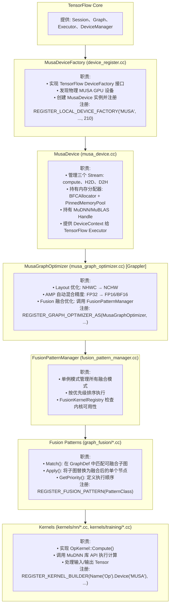
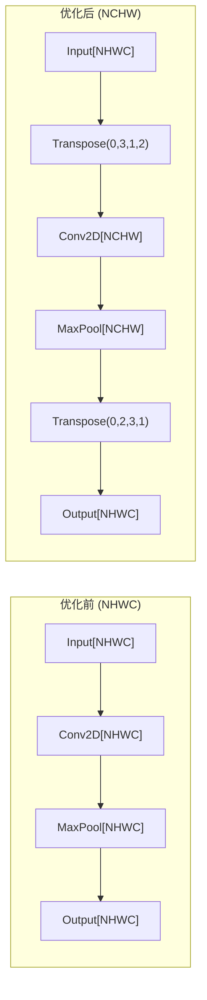
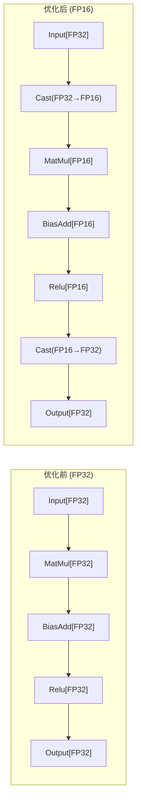
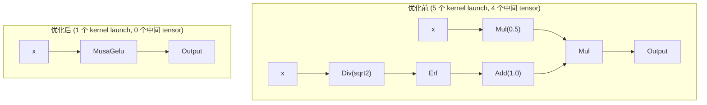
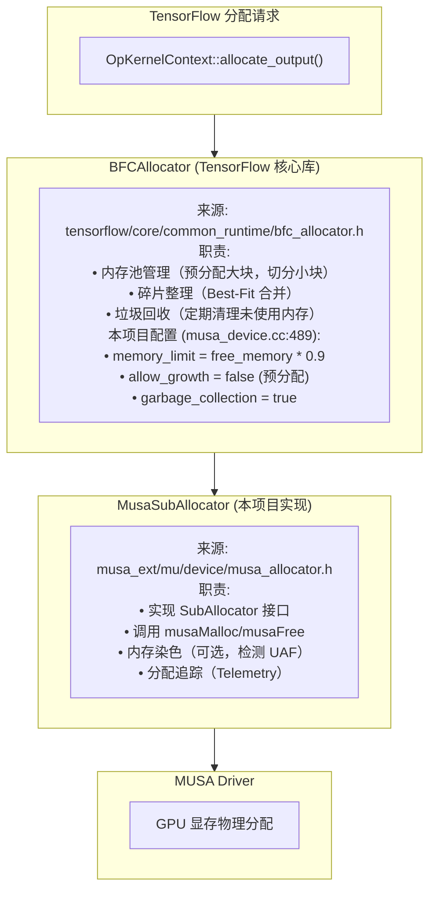
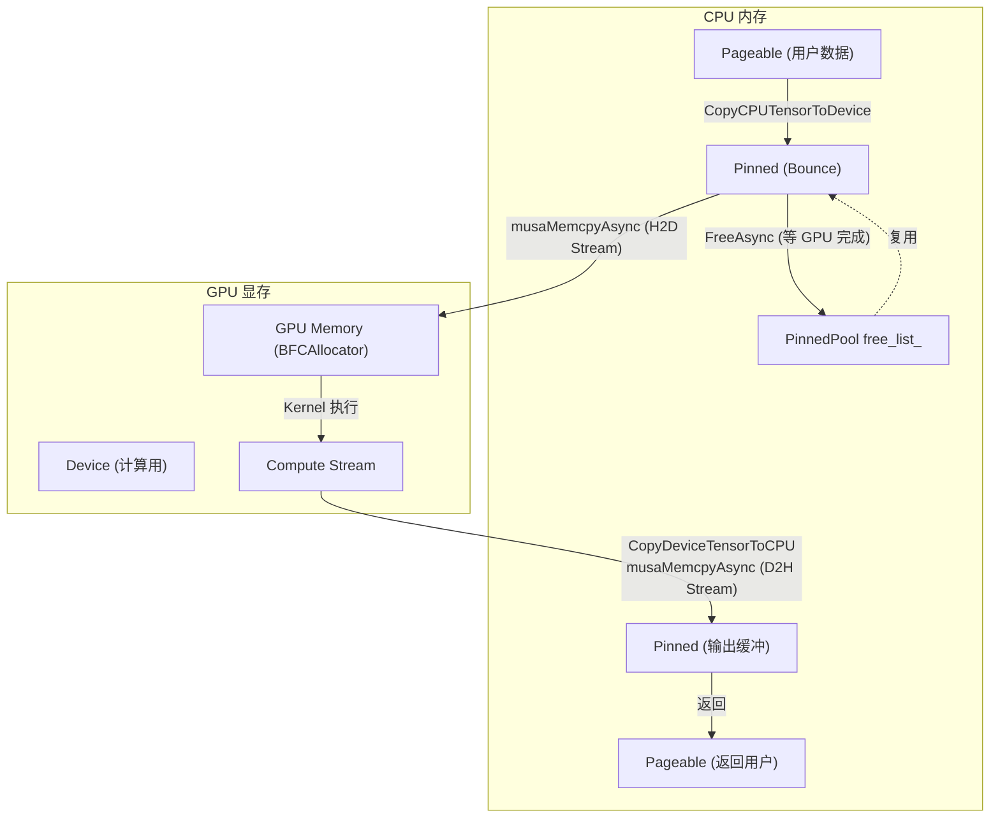
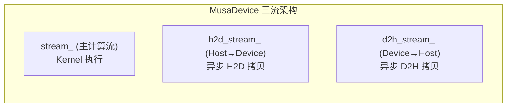
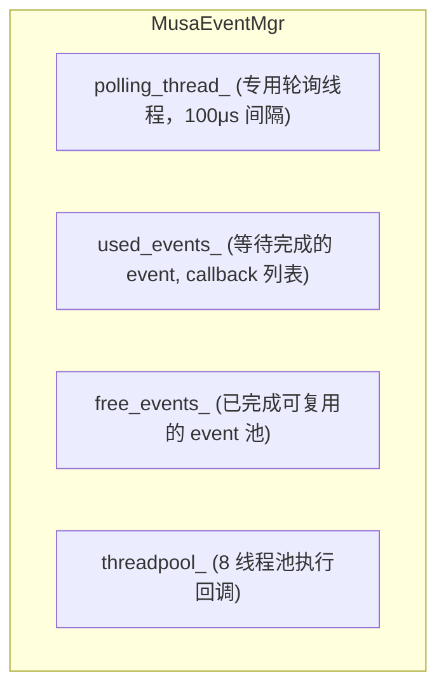
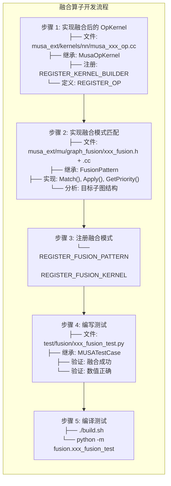

# TensorFlow MUSA Extension 架构详解

本文档详细介绍 TensorFlow MUSA Extension 的整体架构设计、运行流程和核心机制实现。

---

## 一、整体运行流程

### 1.1 从用户代码到 GPU 执行的完整流程

```mermaid
flowchart TB
    subgraph UserCode["用户 Python 代码"]
        code["import tensorflow as tf<br/>tf.load_library('./build/libmusa_plugin.so')<br/>with tf.device('/device:MUSA:0'):<br/>    result = tf.nn.gelu(x)"]
    end

    subgraph PluginLoad["1. 插件加载阶段 (Plugin Load)"]
        load["__attribute__((constructor)) OnMusaPluginLoad()<br/>├── 初始化 Telemetry 系统<br/>└── 静态注册: DeviceFactory、GraphOptimizer、Kernels、FusionPatterns"]
    end

    subgraph DeviceDiscovery["2. 设备发现阶段 (Device Discovery)"]
        discover["MusaDeviceFactory::CreateDevices()<br/>├── musaGetDeviceCount() → 发现物理 GPU<br/>├── musaMemGetInfo() → 获取显存信息<br/>├── 创建 MusaDevice 实例<br/>│   ├── 创建 3 个 Stream<br/>│   ├── 创建 BFCAllocator + MusaSubAllocator<br/>│   ├── 创建 GPUPinnedMemoryPool<br/>│   ├── 创建 MuDNN/MuBLAS Handle<br/>│   └── 创建 MusaEventMgr<br/>└── 注册到 TensorFlow DeviceManager"]
    end

    subgraph GraphBuilding["3. 图构建阶段 (Graph Building)"]
        build["TensorFlow 构建计算图<br/>├── 用户定义: tf.nn.gelu(x)<br/>└── 生成 GraphDef (节点: Mul, Erf, Add, Div, Const...)<br/>    数据格式: NHWC, 数据类型: FP32"]
    end

    subgraph GraphOptimization["4. 图优化阶段 (Graph Optimization)"]
        optimize["MusaGraphOptimizer::Optimize()<br/>├── Step 1: Layout Optimization (NHWC → NCHW)<br/>│   └── 插入 Transpose 节点，修改 data_format 属性<br/>├── Step 2: AMP Optimization (FP32 → FP16)<br/>│   └── 插入 Cast 节点，修改 T 属性<br/>└── Step 3: Fusion Optimization<br/>    ├── 遍历所有注册的 FusionPattern<br/>    ├── Pattern.Match() → 匹配 GELU 子图<br/>    └── Pattern.Apply() → 替换为 MusaGelu 节点"]
    end

    subgraph SessionExecution["5. 会话执行阶段 (Session Execution)"]
        execute["TensorFlow Executor 执行优化后的图<br/>├── 调度节点到 MUSA 设备<br/>├── 内存分配: BFCAllocator::Allocate()<br/>├── 数据传输: CopyCPUTensorToDevice()<br/>│   ├── H2D Stream 异步拷贝<br/>│   └── Event 同步 → Compute Stream<br/>└── Kernel 执行: MusaGeluOp::Compute()<br/>    ├── 获取 MuDNN Handle<br/>    ├── 创建 mTensor 输入/输出<br/>    └── mUnary::Run(handle, output, input)"]
    end

    subgraph ResultRetrieval["6. 结果回传阶段 (Result Retrieval)"]
        result["CopyDeviceTensorToCPU()<br/>├── Compute Stream → Event Record<br/>├── D2H Stream → Event Wait + MemcpyAsync<br/>├── MusaEventMgr 轮询 → 回调执行<br/>└── 返回结果到用户"]
    end

    UserCode --> PluginLoad --> DeviceDiscovery --> GraphBuilding --> GraphOptimization --> SessionExecution --> ResultRetrieval
```



### 1.2 各层级职责



---

## 二、计算图优化详解

### 2.1 三阶段优化流水线

```cpp
Status MusaGraphOptimizer::Optimize(Cluster* cluster, const GrapplerItem& item,
                                    GraphDef* optimized_graph) {
  // Step 1: Layout Optimization (NHWC → NCHW)
  if (configs_.layout_optimizer != TriState::kOff) {
    OptimizeLayout(optimized_graph);
  }

  // Step 2: AMP Optimization (FP32 → FP16)
  if (configs_.auto_mixed_precision != TriState::kOff) {
    OptimizeAMP(optimized_graph);
  }

  // Step 3: Fusion Optimization
  if (configs_.remapping != TriState::kOff) {
    OptimizeFusion(optimized_graph);
  }
}
```

### 2.2 Layout 优化 (NHWC → NCHW)

**目的**: MuDNN 对 NCHW 格式有更好的优化



**实现逻辑**:

```cpp
void OptimizeLayout(GraphDef* graph) {
  for (NodeDef* node : graph->nodes) {
    if (!IsMusaNCHWSupported(node)) continue;
    if (IsAlreadyNCHW(node)) continue;

    // 1. 插入前置 Transpose (NHWC → NCHW)
    string pre_name = node->name() + "/pre_transpose_nchw";
    InsertTranspose(graph, pre_name, node->input(0), {0, 3, 1, 2});

    // 2. 修改节点的 data_format 属性
    (*node->attr())["data_format"] = "NCHW";

    // 3. 修改 layout 相关属性 (strides, dilations)
    RewriteLayoutAttributes(node);

    // 4. 插入后置 Transpose (NCHW → NHWC)
    string post_name = node->name() + "/post_transpose_nhwc";
    InsertTranspose(graph, post_name, node->name(), {0, 2, 3, 1});

    // 5. 重定向下游节点的输入
    RedirectEdges(graph, node->name(), post_name);
  }
}
```

**Layout-Sensitive 算子**:
- Conv2D, DepthwiseConv2dNative, MaxPool, AvgPool, FusedBatchNorm

### 2.3 AMP 自动混合精度优化

**目的**: 在保持精度的前提下，使用 FP16/BF16 加速计算



**算子分类**:

| 类型 | 算子 | 行为 |
|------|------|------|
| **FP16 Compute** | MatMul, Conv2D, BatchMatMul, FusedBatchNorm | 可安全降精度 |
| **FP32 Keep** | Softmax, Log, Exp, Mean, L2Loss | 必须保持 FP32 |
| **Conditional** | Add, Sub, Mul, BiasAdd | 根据输入决定 |
| **Activation** | Relu, Sigmoid, Tanh | 跟随上游算子 |

**实现逻辑**:

```cpp
void OptimizeAMP(GraphDef* graph) {
  // 1. 分析图，决定哪些节点需要转换
  std::unordered_map<string, bool> should_convert;
  AnalyzeGraphForAMP(*graph, should_convert);

  // 2. 对需要转换的节点插入 Cast
  for (NodeDef* node : graph->nodes) {
    if (!should_convert[node->name()]) continue;

    // 插入输入 Cast
    for (int i = 0; i < node->input_size(); ++i) {
      string cast_name = node->name() + "/Input_" + i + "/CastF2Lower";
      InsertCast(graph, cast_name, node->input(i), DT_FLOAT, DT_HALF);
      node->set_input(i, cast_name);
    }

    // 修改节点类型
    (*node->attr())["T"] = DT_HALF;

    // 插入输出 Cast
    string cast_out = node->name() + "/Output/CastLower2F";
    InsertCast(graph, cast_out, node->name(), DT_HALF, DT_FLOAT);
    RedirectEdges(graph, node->name(), cast_out);
  }
}
```

### 2.4 Fusion 算子融合优化

**目的**: 将多个小算子合并为一个大算子，减少 kernel launch 开销和中间结果存储



**融合流程**:

```cpp
Status OptimizeFusion(GraphDef* graph) {
  auto& pattern_manager = FusionPatternManager::GetInstance();
  auto patterns = pattern_manager.GetSortedPatterns();

  bool graph_modified = true;
  int iteration = 0;

  // 迭代应用融合模式（最多 50 轮）
  while (graph_modified && iteration < 50) {
    graph_modified = false;

    // 正向和反向遍历
    for (bool reverse : {false, true}) {
      for (int node_idx : TraverseNodes(graph, reverse)) {
        for (const auto* pattern : patterns) {
          // 1. 匹配子图
          auto match_result = pattern->Match(*graph, node_idx);
          if (!match_result.matched) continue;

          // 2. 检查内核可用性
          if (!pattern->IsKernelAvailable()) continue;

          // 3. 应用融合替换
          Status status = pattern->Apply(graph, match_result);
          if (status.ok()) {
            graph_modified = true;
            break;  // 图已修改，重新开始扫描
          }
        }
      }
    }
  }
}
```

**已实现的融合模式**:

| 模式 | 优先级 | 匹配的子图结构 | 融合后算子 |
|------|--------|----------------|-----------|
| GELU | 90 | `0.5*x*(1+erf(x/sqrt(2)))` | MusaGelu |
| LayerNorm | 1 | `Normalize * gamma + beta` | MusaLayerNorm |
| Linear+ReLU | - | `ReLU(MatMul + bias)` | MusaLinearRelu |
| Normalize | - | `(x-mean)/sqrt(var+eps)` | MusaNormalize |

---

## 三、内存管理详解

### 3.1 内存分配架构



### 3.2 本项目的内存分配实现

**MusaSubAllocator::Alloc** (`musa_allocator.h:314-370`):

```cpp
void* MusaSubAllocator::Alloc(size_t alignment, size_t num_bytes, size_t* received) {
  if (num_bytes == 0) {
    *received = 0;
    return nullptr;
  }

  // 确保最小 256 字节对齐
  size_t min_alignment = 256;
  if (alignment < min_alignment) alignment = min_alignment;

  // 向上对齐分配大小
  size_t alloc_size = (num_bytes + alignment - 1) & ~(alignment - 1);

  // 实际分配
  musaSetDevice(device_id_);
  void* ptr = nullptr;
  musaError_t err = musaMalloc(&ptr, alloc_size);
  if (err != musaSuccess) {
    LOG(WARNING) << "MusaSubAllocator: musaMalloc failed for " << alloc_size;
    return nullptr;
  }

  *received = alloc_size;

  // 内存染色（可选，用于调试）
  if (MemoryColoringConfig::Instance().enabled()) {
    musaMemset(ptr, 0xAB, alloc_size);  // 分配魔数
  }

  // 记录 Telemetry
  MUSA_TELEMETRY_ON_TENSOR_ALLOCATE(tensor_id, ptr, alloc_size, device_id_);

  return ptr;
}
```

**MusaSubAllocator::Free** (`musa_allocator.h:373-416`):

```cpp
void MusaSubAllocator::Free(void* ptr, size_t num_bytes) {
  if (ptr == nullptr) return;

  // 检测潜在的双重释放或 UAF
  if (MemoryColoringConfig::Instance().track_history()) {
    if (!MemoryForensicsTracker::Instance().IsAddressAllocated(ptr)) {
      LOG(WARNING) << "[MemoryForensics] Potential double-free or UAF";
    }
  }

  // 内存染色验证（可选）
  if (MemoryColoringConfig::Instance().verify_on_free()) {
    VerifyMemoryColoring(ptr, num_bytes);
  }

  // 填充释放魔数（用于检测 UAF）
  if (MemoryColoringConfig::Instance().enabled()) {
    musaMemset(ptr, 0xCD, num_bytes);  // 释放魔数
  }

  // 记录 Telemetry
  MUSA_TELEMETRY_ON_TENSOR_FREE(tensor_id, ptr, num_bytes, device_id_);

  // 实际释放
  musaSetDevice(device_id_);
  musaFree(ptr);
}
```

### 3.3 MusaDevice 初始化分配器

**代码位置**: `musa_device.cc:484-505`

```cpp
MusaDevice::MusaDevice(...) {
  // 1. 先获取空闲内存（在任何分配之前！）
  musaMemGetInfo(&free_memory, &total_memory);
  size_t bfc_memory_limit = free_memory * 0.9;  // 留 10% 余量

  // 2. 创建 GPU 显存分配器
  // BFCAllocator 是 TensorFlow 核心库提供的，MusaSubAllocator 是本项目实现的
  musa_allocator_ = new BFCAllocator(
    new MusaSubAllocator(device_id_, {}, {}),
    bfc_memory_limit,
    false,  // allow_growth=false：预分配
    "Musa_BFC_Allocator",
    true    // garbage_collection：自动回收
  );

  // 3. 创建 Host 锁页内存分配器
  musa_host_allocator_ = new BFCAllocator(
    new MusaHostSubAllocator({}, {}),
    256ULL * 1024 * 1024,  // 256 MB
    true, "Musa_Host_BFC_Allocator", true
  );

  // 4. 创建 Bounce Buffer 内存池
  pinned_memory_pool_ = new GPUPinnedMemoryPool(device_id_);
}
```

### 3.4 GPUPinnedMemoryPool（锁页内存池）

**解决问题**: Pageable 内存无法直接异步拷贝，且 BFCAllocator 立即复用内存可能导致异步操作竞争

```
问题场景:
  1. Allocate bounce_buffer
  2. musaMemcpyAsync(dst, bounce_buffer, ..., h2d_stream)  // 异步
  3. Free bounce_buffer  // BFCAllocator 立即复用
  4. 新分配使用同一地址
  5. GPU 异步拷贝仍在执行 → 数据竞争 → 脏数据
```

**解决方案**:

```cpp
class GPUPinnedMemoryPool {
  std::vector<Block> free_list_;      // 已完成，可复用
  std::list<Block> pending_frees_;    // 等待 GPU 完成
};

// 分配
void* Allocate(size_t bytes) {
  mutex_lock l(mu_);
  PollPendingFrees();  // 检查完成的块

  // 从 free_list 找最匹配的块
  for (auto& block : free_list_) {
    if (block.size >= bytes) return block.ptr;
  }

  // 没有可用，分配新内存
  musaHostAlloc(&ptr, bytes, musaHostAllocDefault);
  return ptr;
}

// 异步释放（不立即复用！）
void FreeAsync(void* ptr, size_t bytes, musaStream_t stream) {
  // 记录 event
  musaEvent_t event;
  musaEventCreateWithFlags(&event, musaEventDisableTiming);
  musaEventRecord(event, stream);

  // 加入 pending_frees，等待 GPU 完成
  pending_frees_.push_back({ptr, bytes, event});
}

// 后台轮询线程
void PollLoop() {
  while (true) {
    mutex_lock l(mu_);
    for (auto it = pending_frees_.begin(); it != pending_frees_.end();) {
      if (musaEventQuery(it->event) == musaSuccess) {
        // GPU 已完成，移动到 free_list
        musaEventDestroy(it->event);
        free_list_.push_back(*it);
        it = pending_frees_.erase(it);
      } else {
        ++it;
      }
    }
    Env::Default()->SleepForMicroseconds(100);  // 100μs
  }
}
```

### 3.5 内存流动完整图



---

## 四、流管理与同步机制

### 4.1 三流架构



**设计目的**: H2D/D2H 拷贝与计算并行，减少流水线停顿

### 4.2 跨流同步机制

```cpp
void CopyCPUTensorToDevice(...) {
  // 1. 在 h2d_stream 上发起异步拷贝
  musaMemcpyAsync(dst, src, bytes, musaMemcpyHostToDevice, h2d_stream_);

  // 2. 创建 event 记录拷贝完成
  musaEvent_t copy_done_event;
  musaEventCreateWithFlags(&copy_done_event, musaEventDisableTiming);
  musaEventRecord(copy_done_event, h2d_stream_);

  // 3. compute stream 等待 event
  musaStreamWaitEvent(stream_handle_, copy_done_event, 0);

  // 4. 延迟销毁 event（关键！musaStreamWaitEvent 是异步的）
  event_mgr_->ThenExecute(stream_handle_, [copy_done_event]() {
    musaEventDestroy(copy_done_event);
  });
}
```

### 4.3 MusaEventMgr 轮询机制



**轮询循环**:

```cpp
void PollLoop() {
  while (true) {
    mutex_lock l(mu_);

    // 等待事件
    while (!stop_polling_ && used_events_.empty()) {
      events_pending_.wait(l);
    }
    if (stop_polling_) break;

    // 遍历检查每个 event（Out-of-Order）
    for (auto it = used_events_.begin(); it != used_events_.end();) {
      if (musaEventQuery(it->event) == musaSuccess) {
        to_free.push_back(*it);
        it = used_events_.erase(it);
      } else {
        ++it;
      }
    }

    // 在线程池中执行回调
    for (auto& iu : to_free) {
      threadpool_.Schedule([func=iu.func, device_id]() {
        musaSetDevice(device_id);
        func();
      });
    }
  }
}
```

---

## 五、算子融合开发指南

### 5.1 融合开发完整流程



### 5.2 GELU 融合示例

**目标子图**:

```
GELU Exact: 0.5 * x * (1 + erf(x / sqrt(2)))

原图结构:
  Mul (final_output)
  ├── Mul (half_x = 0.5 * x)
  │   ├── Const(0.5)
  │   └── x (input)
  └── Add (one_plus_erf = 1 + erf)
      ├── Const(1.0)
      └── Erf
          └── Div/Mul (x / sqrt(2) 或 x * rsqrt(2))
              ├── x (input) ← 必须与 half_x 的 x 相同！
              └── Const(sqrt(2) 或 rsqrt(2))
```

**匹配代码**:

```cpp
FusionMatchResult Match(const GraphDef& graph, int start_node_idx) const {
  const NodeDef& final_mul = graph.node(start_node_idx);
  if (final_mul.op() != "Mul") return {};

  // 1. 找 half_x 分支 (0.5 * x)
  const NodeDef* half_x_mul = FindProducer(graph, final_mul.input(0));
  if (!MatchConstAndOther(half_x_mul, graph, 0.5f, &input_node)) return {};

  // 2. 找 erf 分支 (1 + erf(x/sqrt(2)))
  const NodeDef* add_node = FindProducer(graph, final_mul.input(1));
  if (!MatchErfFactor(add_node, graph, input_node)) return {};

  // 3. 构建匹配结果
  FusionMatchResult result;
  result.matched = true;
  result.captured_nodes["output"] = &final_mul;
  result.captured_nodes["input"] = input_node;
  return result;
}
```

**替换代码**:

```cpp
Status Apply(GraphDef* graph, const FusionMatchResult& match) const {
  const NodeDef* output_node = match.captured_nodes["output"];
  const NodeDef* input_node = match.captured_nodes["input"];

  // 1. 原节点重命名为 _original
  string original_name = output_node->name();
  output_node->set_name(original_name + "_original");

  // 2. 创建融合节点
  NodeDef* fused = graph->add_node();
  fused->set_name(original_name);
  fused->set_op("MusaGelu");
  fused->set_device(output_node->device());
  fused->add_input(input_node->name());
  (*fused->attr())["T"] = DT_FLOAT;
  (*fused->attr())["approximate"] = false;

  // 3. 清理无用节点
  RemoveNodesIfUnused(graph, matched_nodes);

  return Status::OK();
}
```

---

## 六、关键设计总结

| 机制 | 来源 | 问题 | 解决方案 |
|------|------|------|----------|
| **三流架构** | 本项目 | 拷贝阻塞计算 | H2D/D2H/Compute 分离 + Event 同步 |
| **BFCAllocator** | TensorFlow 核心 | GPU 显存碎片化 | 内存池 + Best-Fit + 垃圾回收 |
| **MusaSubAllocator** | 本项目 | 底层 GPU 内存分配 | 封装 musaMalloc/musaFree + 内存染色 |
| **PinnedMemoryPool** | 本项目 | 异步拷贝内存复用竞争 | Event 追踪 + 延迟回收 |
| **Bounce Buffer** | 本项目 | Pageable 内存不能异步拷贝 | Pinned 内存中转 |
| **Event 轮询** | 本项目 | 同步等待阻塞线程 | 专用线程轮询 + 线程池回调 |
| **Out-of-Order** | 本项目 | 慢 Event 阻塞后续 | std::list 遍历 + 独立处理 |
| **Layout 优化** | 本项目 | NHWC 对 GPU 不友好 | 插入 Transpose 转换为 NCHW |
| **AMP 优化** | 本项目 | FP32 计算慢 | 插入 Cast 使用 FP16 计算 |
| **Fusion 优化** | 本项目 | 多次 kernel launch | 子图匹配替换为融合算子 |

---

**文档版本**: 2026-04-10
**适用版本**: TensorFlow MUSA Extension v1.0+