# TensorFlow MUSA Extension 当前内存管理架构

本文档说明当前 TensorFlow MUSA Extension 中设备显存、Host Pinned 内存、Bounce Buffer、Stream/Event 与异步回调管理之间的分工与协作关系。

> 本文按当前代码实现整理，`docs/memoryalloc.md` 仅作为行文格式参考，不覆盖原文档。

---

## 一、核心问题：当前架构中有哪些内存与管理路径？

当前实现同时存在两套相关但入口不同的运行路径：

1. **Legacy TensorFlow Device 路径**：`MusaDevice` / `MusaDeviceContext`
2. **StreamExecutor / Pluggable Device 路径**：`musa_se_plugin.cc` + `MusaSeRuntimeRegistry`

它们共享同一类底层 MUSA Runtime 能力，但在 TensorFlow 调用入口、allocator 暴露方式、copy 处理细节上有所不同。

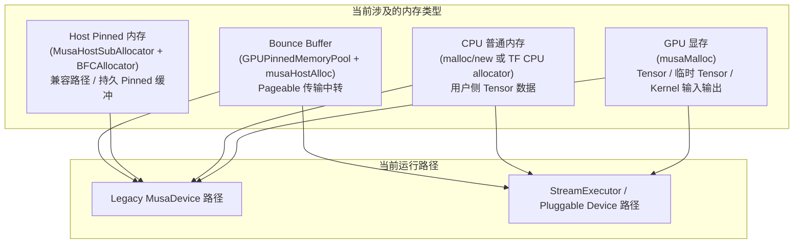

### 1.1 当前内存管理组件总览

| 组件 | 管理对象 | 底层 API | 主要用途 | 当前定位 |
|------|----------|----------|----------|----------|
| `BFCAllocator + MusaSubAllocator` | GPU 显存 | `musaMalloc` / `musaFree` | TensorFlow Tensor 的设备端存储 | 主设备 allocator |
| `BFCAllocator + MusaHostSubAllocator` | Host Pinned 内存 | `musaHostAlloc` / `musaFreeHost` | 兼容路径、持久 pinned host 缓冲 | 保留但非普通 `on_host` 默认路径 |
| `GPUPinnedMemoryPool` | Host Pinned Bounce Buffer | `musaHostAlloc` / `musaFreeHost` | Pageable H2D/D2H 传输中转 | 独立池，异步延迟复用 |
| `MusaEventMgr` | Event + 回调 | `musaEventRecord` / `musaEventQuery` | Stream 完成后的回调执行 | 异步回调管理器 |
| `MusaSeRuntimeRegistry` | SE 路径运行时状态 | 组合管理 | SE 每设备状态、EventMgr、PinnedPool、muDNN handle | Pluggable Device 辅助状态 |

### 1.2 关键变化点

当前架构中需要特别注意：

1. `MusaDevice::GetAllocator(attr)` 对 `attr.on_host()` 返回的是 TensorFlow CPU allocator，而不是 `musa_host_allocator_`。
2. `musa_host_allocator_` 仍然创建，但当前更多是兼容保留，而不是所有 Host Tensor 的默认 allocator。
3. Bounce Buffer 不使用 BFC 管理，而是由 `GPUPinnedMemoryPool` 独立管理，避免异步 copy 未完成时地址被立即复用。
4. SE / Pluggable Device 路径有自己的 per-device registry，用于懒加载 `MusaEventMgr`、`GPUPinnedMemoryPool` 和按 stream 绑定的 muDNN handle。
5. Legacy 路径同时管理 H2D Stream、D2H Stream、Compute Stream；SE 路径更多依赖 TensorFlow StreamExecutor 调用传入的 stream。

---

## 二、GPU 显存管理：BFCAllocator + MusaSubAllocator

### 2.1 使用场景

GPU 显存主要用于 TensorFlow 设备 Tensor 的存储，包括 OpKernel 输入输出、中间 Tensor 和临时 Tensor。

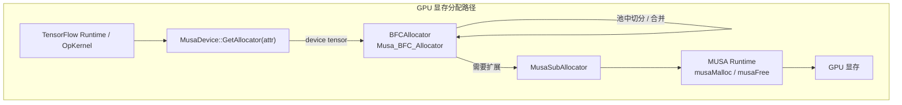

### 2.2 MusaSubAllocator 的职责

`MusaSubAllocator` 是 TensorFlow BFCAllocator 下方的实际设备显存分配器，封装：

- `musaMalloc` / `musaFree`
- MUSA device 上下文切换
- TensorFlow allocator visitor 回调
- 可选的内存调试 / telemetry / coloring 逻辑
- 对齐、分配失败日志等辅助处理

**代码位置**：

| 符号 | 文件 |
|------|------|
| `MusaSubAllocator` | `musa_ext/mu/device/musa_allocator.h` |
| `MusaDevice` 创建 device BFC | `musa_ext/mu/device/musa_device.cc` |
| Pluggable Device allocator hooks | `musa_ext/mu/musa_se_plugin.cc` |

### 2.3 Legacy MusaDevice 中的 GPU BFC 初始化

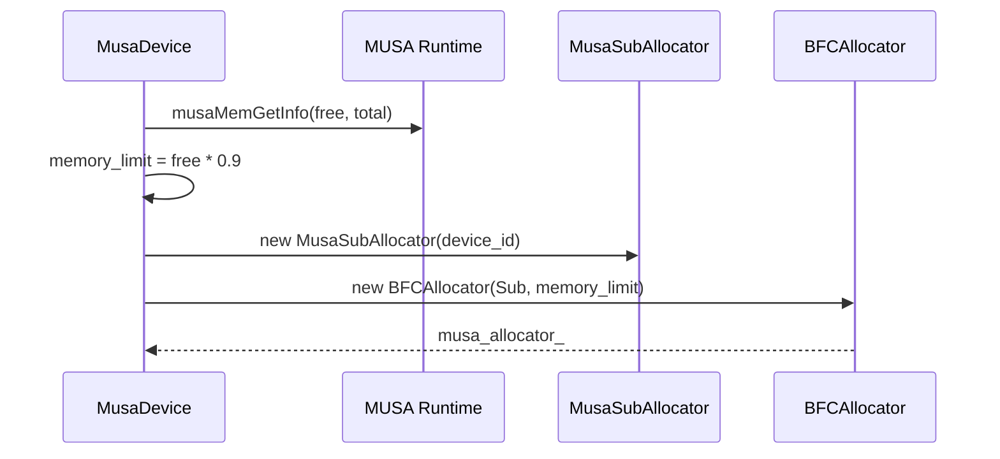

当前 Legacy `MusaDevice` 构造时会先查询空闲显存，再用约 90% 的 free memory 构造 `BFCAllocator`。

### 2.4 Tensor 生命周期

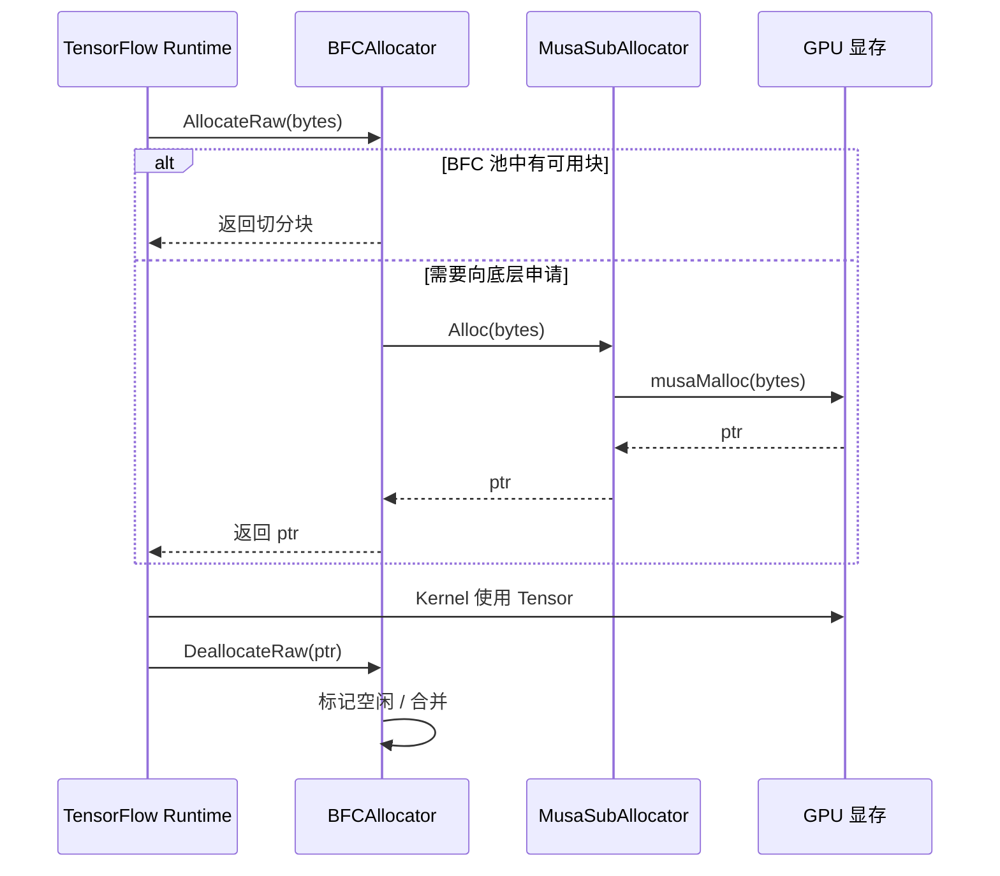

**关键点**：GPU Tensor 显存的复用由 TensorFlow BFCAllocator 负责。BFC 的职责是池化设备显存，减少频繁 `musaMalloc` / `musaFree` 的开销。

---

## 三、Host Pinned 内存：兼容 BFC 与传输专用 Pool

### 3.1 当前有两类 Host Pinned 管理机制

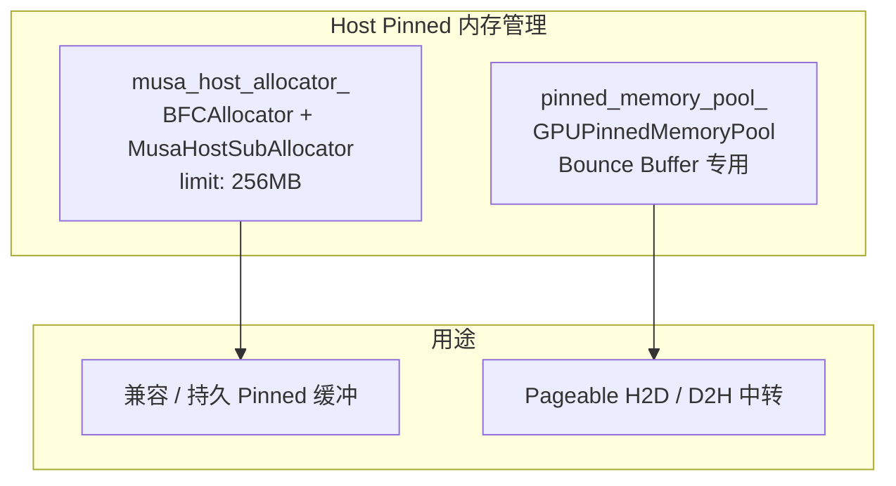

| 机制 | 是否 BFC | 释放策略 | 用途 |
|------|----------|----------|------|
| `musa_host_allocator_` | 是 | BFC 同步复用 | 兼容路径 / 持久 Pinned Host 分配 |
| `GPUPinnedMemoryPool` | 否 | Event 追踪，延迟复用 | Bounce Buffer，避免异步 copy 竞争 |

### 3.2 MusaHostSubAllocator

`MusaHostSubAllocator` 封装 `musaHostAlloc` 和 `musaFreeHost`，作为 Host Pinned BFCAllocator 的底层 suballocator。

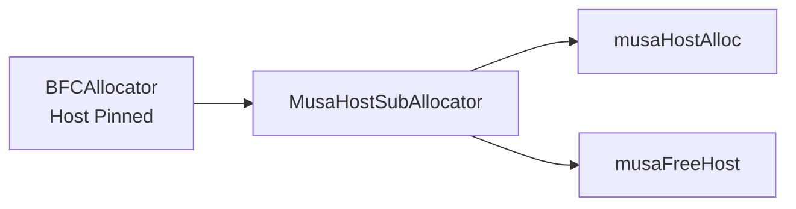

**代码位置**：`musa_ext/mu/device/musa_host_allocator.h`

### 3.3 当前 GetAllocator 的重要行为

当前 Legacy `MusaDevice::GetAllocator` 的选择逻辑可以概括为：

```cpp
if (attr.on_host()) {
    return cpu_allocator();
}
return musa_allocator_;
```

也就是说：

- 普通 `on_host` allocator 请求返回 TensorFlow CPU allocator。
- 设备 Tensor 返回 MUSA GPU BFC allocator。
- `musa_host_allocator_` 仍然被构造和析构，但不是普通 `on_host` 的默认返回值。

---

## 四、为什么 Bounce Buffer 必须独立管理？

### 4.1 Pageable 内存与异步拷贝限制

Pageable CPU 内存通常不能直接作为高效异步 DMA 的稳定源/目标。为了让大块 Pageable 传输尽量不阻塞计算路径，当前实现会使用 Pinned Bounce Buffer 做中转。

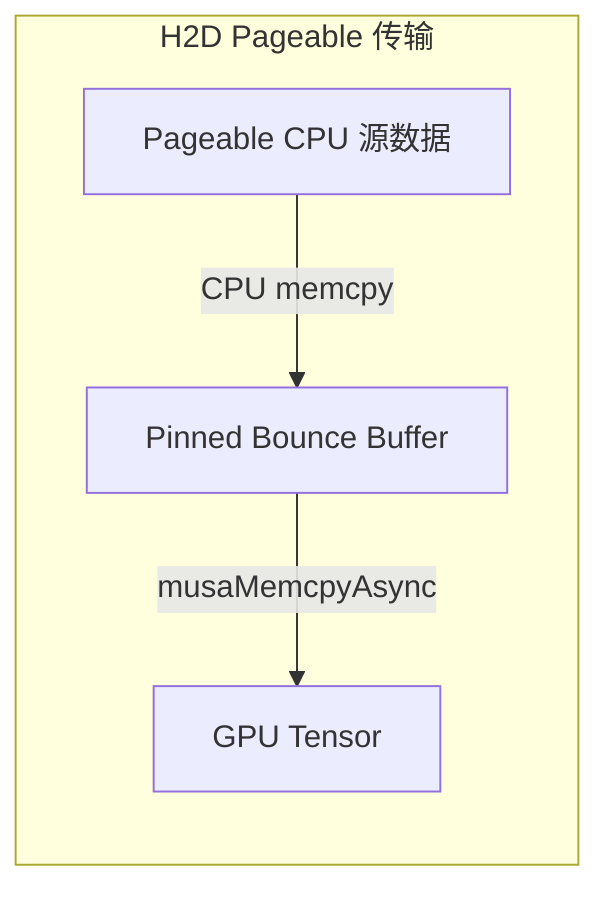

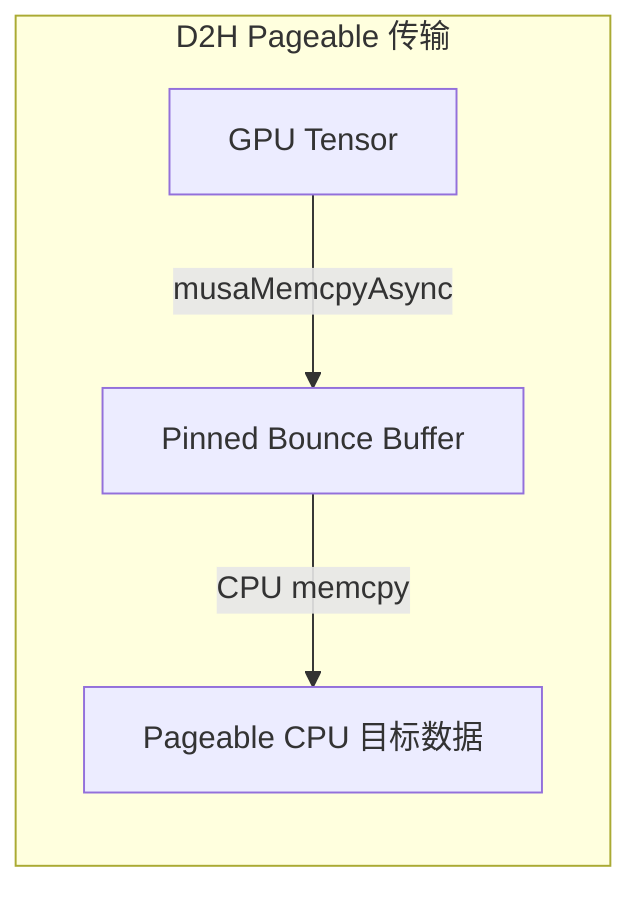

### 4.2 为什么不能直接用 BFC 管 Bounce Buffer？

Bounce Buffer 的危险点在于释放请求发生时，GPU copy 可能还没有完成。

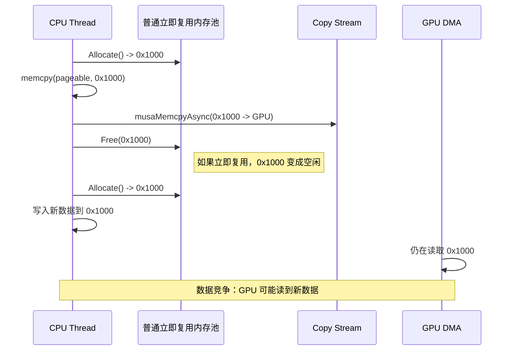

因此 Bounce Buffer 需要满足：

1. `FreeAsync(ptr, stream)` 后不能立即进入可复用列表。
2. 必须在 `stream` 上记录 event。
3. 只有 event 完成后，内存块才能回到 free list。

---

## 五、GPUPinnedMemoryPool：Bounce Buffer 专用内存池

### 5.1 内部结构

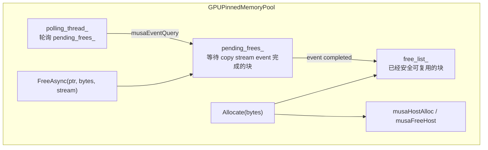

### 5.2 Allocate 流程

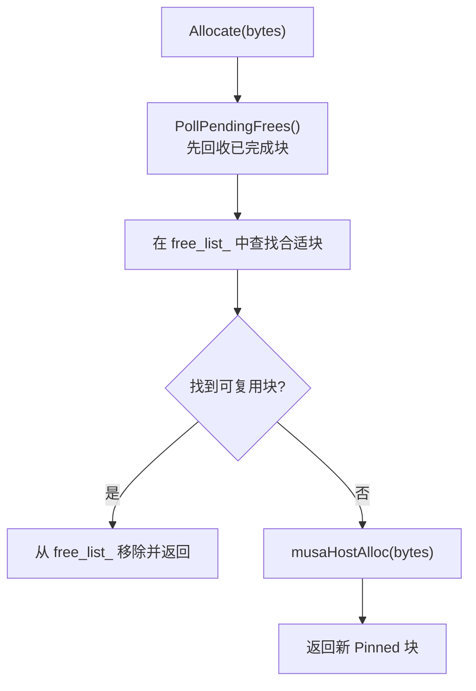

### 5.3 FreeAsync 流程

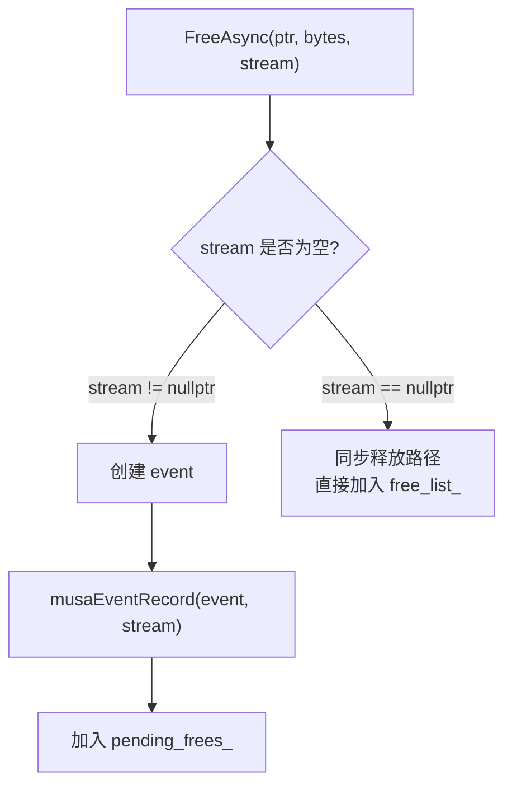

### 5.4 轮询回收流程

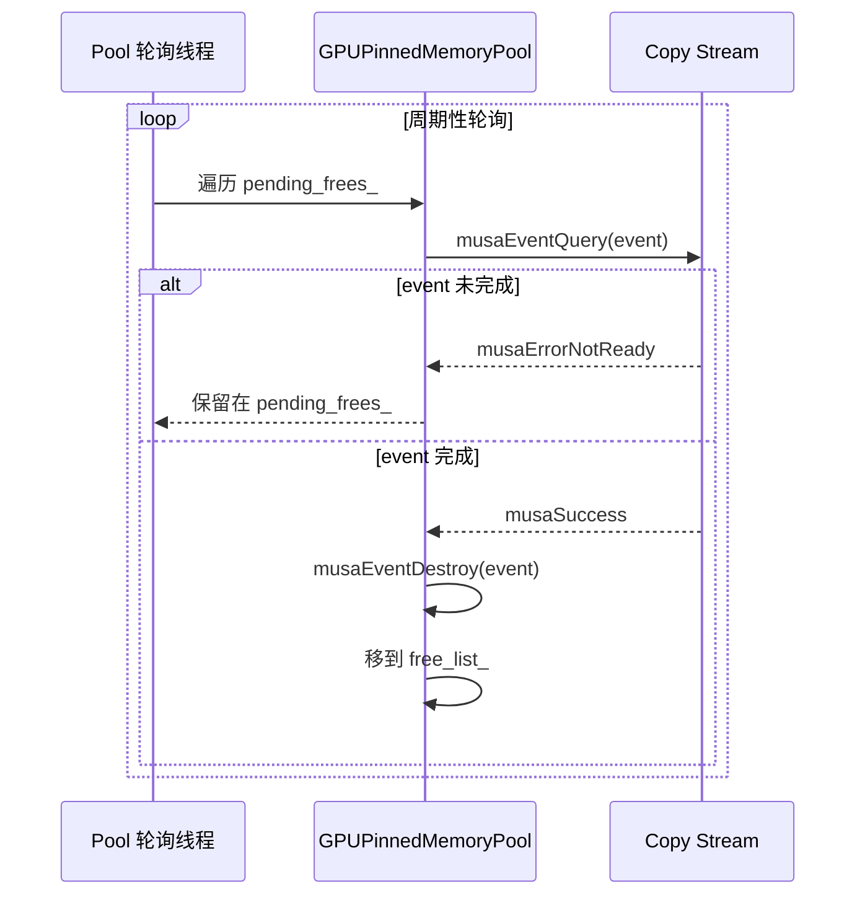

**代码位置**：

| 符号 | 文件 |
|------|------|
| `GPUPinnedMemoryPool` 声明 | `musa_ext/mu/device/pinned_memory_pool.h` |
| `Allocate` / `FreeAsync` / `PollPendingFrees` | `musa_ext/mu/device/pinned_memory_pool.cc` |
| Legacy `MusaDevice` 持有 `pinned_memory_pool_` | `musa_ext/mu/device/musa_device.h` |
| SE registry 懒加载 pinned pool | `musa_ext/mu/musa_runtime_registry.cc` |

---

## 六、MusaEventMgr：Stream 完成后的异步回调管理器

### 6.1 解决的问题

有些场景不仅需要知道 GPU copy 完成，还需要在完成后执行 CPU 侧动作，例如：

- D2H pageable：GPU -> bounce 完成后，需要 `memcpy(bounce -> pageable)`。
- copy 完成后调用 TensorFlow `done(Status::OK())`。
- 延迟销毁跨 stream 同步用的 event。
- SE 路径中维护 stream dependency event 生命周期。

这些动作不属于内存池本身，因此由 `MusaEventMgr` 管理。

### 6.2 MusaEventMgr 与 GPUPinnedMemoryPool 的区别

| 特性 | GPUPinnedMemoryPool | MusaEventMgr |
|------|---------------------|--------------|
| 管理对象 | Pinned memory block | Event + callback |
| 触发 API | `FreeAsync(ptr, bytes, stream)` | `ThenExecute(stream, callback)` / callback queue |
| 等待对象 | 某个 copy stream 上的释放 event | 任意 stream 上记录的 event |
| 完成后动作 | 内存块回到 `free_list_` | 在线程池中执行回调 |
| 是否执行用户代码 | 否 | 是 |
| 典型场景 | H2D bounce buffer 延迟复用 | D2H CPU memcpy、done 回调、event 销毁 |

### 6.3 内部结构

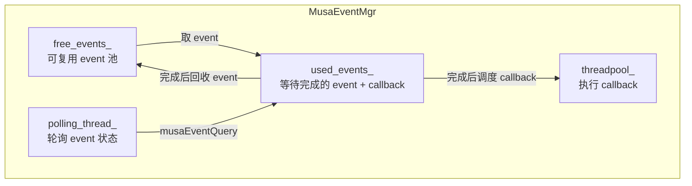

### 6.4 ThenExecute 流程

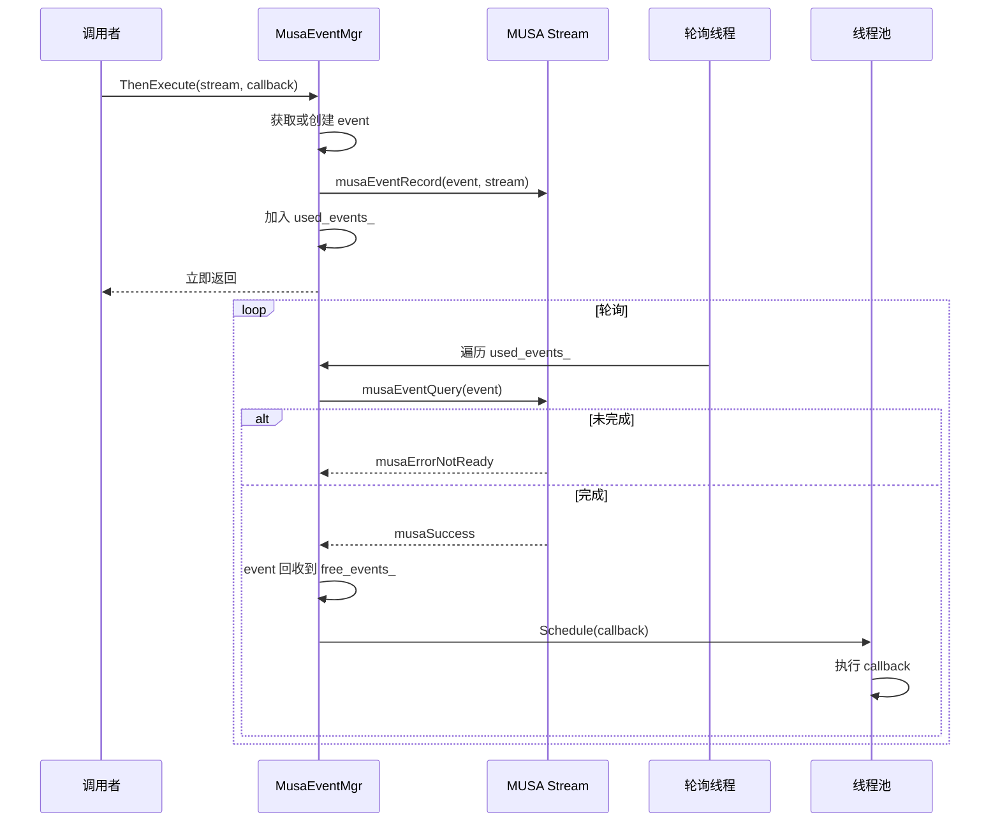

### 6.5 Out-of-Order 完成

`MusaEventMgr` 使用 list 保存等待中的 event，可以跳过未完成 event，继续检查后面的 event，避免 Head-of-Line 阻塞。


**关键点**：轮询线程只负责检测完成与调度回调，不直接执行耗时回调，避免阻塞后续 event 检测。

---

## 七、Legacy MusaDevice 路径：H2D / D2H 传输流程

Legacy 路径由 `MusaDeviceContext` 处理 TensorFlow DeviceContext 的 copy 请求。

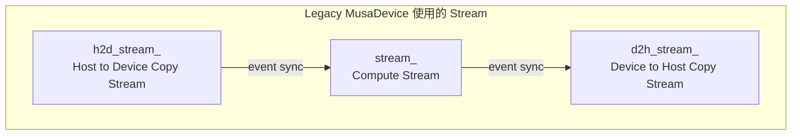

### 7.1 H2D：CPU Tensor -> GPU Tensor

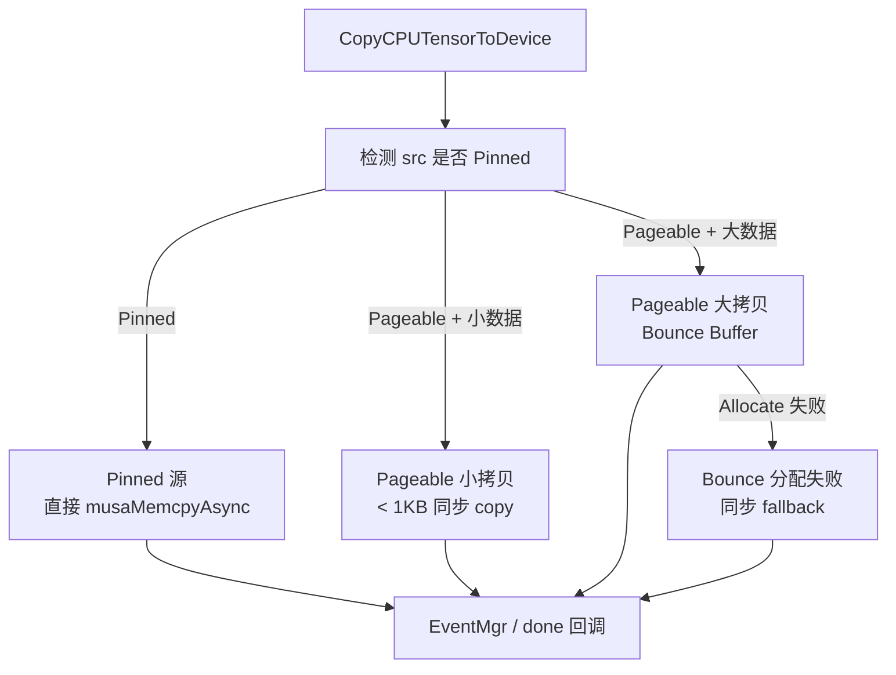

#### 7.1.1 Pinned 源路径

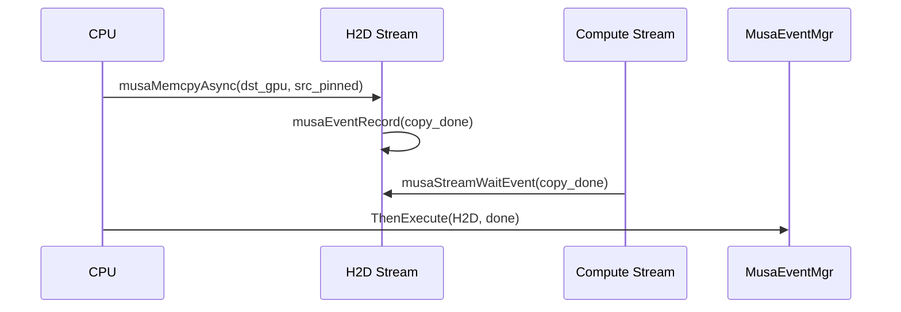

当前实现还支持通过环境变量让部分 H2D copy 直接走 compute stream，减少跨 stream event 同步。

#### 7.1.2 Pageable 大拷贝路径

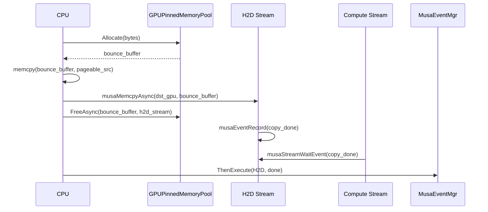

**关键点**：H2D pageable 的 bounce buffer 在 copy 提交后立即调用 `FreeAsync`，但不会立即复用；它要等 H2D stream 上的 event 完成后才回到 pool 的 `free_list_`。

### 7.2 D2H：GPU Tensor -> CPU Tensor

```mermaid
flowchart TB
    Start["CopyDeviceTensorToCPU"]
    Check["检测 dst 是否 Pinned"]
    Pinned["Pinned 目标<br/>直接 musaMemcpyAsync"]
    Small["Pageable 小拷贝<br/>< 1KB 同步 copy"]
    Bounce["Pageable 大拷贝<br/>GPU -> Bounce -> Pageable"]
    Fallback["Bounce 分配失败<br/>同步 fallback"]
    Done["done 回调"]

    Start --> Check
    Check -->|"Pinned"| Pinned --> Done
    Check -->|"Pageable + 小数据"| Small --> Done
    Check -->|"Pageable + 大数据"| Bounce --> Done
    Bounce -->|"Allocate 失败"| Fallback --> Done
```

#### 7.2.1 Pinned 目标路径

```mermaid
sequenceDiagram
    participant Compute as Compute Stream
    participant D2H as D2H Stream
    participant EventMgr as MusaEventMgr
    participant CPU as CPU

    Compute->>Compute: musaEventRecord(compute_done)
    D2H->>Compute: musaStreamWaitEvent(compute_done)
    D2H->>D2H: musaMemcpyAsync(dst_pinned, src_gpu)
    CPU->>EventMgr: ThenExecute(D2H, done)
    CPU->>EventMgr: ThenExecute(D2H, destroy compute_done)
```

#### 7.2.2 Pageable 目标路径

```mermaid
sequenceDiagram
    participant CPU as CPU
    participant Pool as GPUPinnedMemoryPool
    participant Compute as Compute Stream
    participant D2H as D2H Stream
    participant EventMgr as MusaEventMgr
    participant TP as EventMgr ThreadPool

    CPU->>Pool: Allocate(bytes)
    Pool-->>CPU: bounce_buffer
    Compute->>Compute: musaEventRecord(compute_done)
    D2H->>Compute: musaStreamWaitEvent(compute_done)
    CPU->>EventMgr: ThenExecute(D2H, destroy compute_done)
    CPU->>D2H: musaMemcpyAsync(bounce_buffer, src_gpu)
    CPU->>EventMgr: ThenExecute(D2H, callback)

    EventMgr->>TP: copy 完成后调度 callback
    TP->>TP: memcpy(pageable_dst, bounce_buffer)
    TP->>Pool: FreeAsync(bounce_buffer, bytes, nullptr)
    TP->>CPU: done(Status::OK())
```

这里 `FreeAsync(..., nullptr)` 表示 D2H 的 GPU -> bounce copy 已经在 callback 触发前完成，所以 pool 可以走同步释放路径，把 block 直接放回 `free_list_`。

### 7.3 小拷贝与 fallback

Legacy 路径中，小于约 1KB 的 pageable copy 会使用同步路径，避免小异步 copy 的 stream/event 开销超过收益。

```mermaid
flowchart LR
    S1["bytes < 1KB"] --> S2["同步 copy"] --> S3["无需 Bounce Buffer"]
```

当 Bounce Buffer 分配失败时，当前实现会回退到同步 copy，优先保证数据正确性。

```mermaid
flowchart LR
    F1["Pool.Allocate 失败"] --> F2["同步 musaMemcpy / synchronize"] --> F3["done(Status::OK or error)"]
```

---

## 八、SE / Pluggable Device 路径：Runtime Registry 与 Copy 行为

### 8.1 SE 路径的运行时状态

Pluggable Device 路径不直接使用 `MusaDevice` 的成员，而是通过 registry 维护每个 MUSA device 的运行时状态。

```mermaid
flowchart TB
    subgraph Registry["MusaSeRuntimeRegistry"]
        State["MusaSeDeviceRuntimeState"]
        Ref["ref_count"]
        EventMgr["event_mgr"]
        Pool["pinned_pool"]
        Mudnn["mudnn_by_stream<br/>每个 stream 一个 handle"]
        Collective["collective_state"]
    end

    State --> Ref
    State --> EventMgr
    State --> Pool
    State --> Mudnn
    State --> Collective
```

### 8.2 SE 设备创建与销毁

```mermaid
sequenceDiagram
    participant TF as TensorFlow PluggableDevice
    participant Plugin as musa_se_plugin.cc
    participant Registry as MusaSeRuntimeRegistry

    TF->>Plugin: plugin_create_device
    Plugin->>Registry: MusaSeRegistryOnDeviceCreated(device_ordinal)
    Registry->>Registry: ref_count++ / 初始化状态

    TF->>Plugin: plugin_destroy_device
    Plugin->>Registry: MusaSeRegistryOnDeviceDestroyed(device_ordinal)
    Registry->>Registry: ref_count--
    alt ref_count == 0
        Registry->>Registry: 清理 muDNN handles
        Registry->>Registry: 清理 EventMgr
        Registry->>Registry: 清理 PinnedPool
    end
```

### 8.3 SE H2D 行为

SE 路径的 H2D 入口会调用 `MemcpyHtoDWithPinnedBounce`，但实际是否使用 bounce buffer 受环境变量和 sync/async 路径影响。

```mermaid
flowchart TB
    H1["plugin_se_memcpy_htod / sync_memcpy_htod"]
    H2["MemcpyHtoDWithPinnedBounce"]
    H3{"是否强制同步 H2D?"}
    H4["musaMemcpy + synchronize"]
    H5{"源内存是否 Pinned?"}
    H6["直接 musaMemcpyAsync"]
    H7{"是否允许 pageable bounce?"}
    H8["PinnedPool Allocate + CPU memcpy + musaMemcpyAsync"]
    H9["blocking musaMemcpy fallback"]

    H1 --> H2 --> H3
    H3 -->|"是"| H4
    H3 -->|"否"| H5
    H5 -->|"Pinned"| H6
    H5 -->|"Pageable"| H7
    H7 -->|"允许"| H8
    H7 -->|"不允许 / 条件不满足"| H9
```

当前 SE 路径通过环境变量控制：

| 环境变量 helper | 作用 |
|-----------------|------|
| `SyncSeH2D()` | 强制 SE H2D 走同步路径 |
| `SePageableH2DBounce()` | 是否允许 pageable H2D 使用 bounce buffer |
| `SeSyncH2DBounce()` | sync H2D 是否允许 bounce buffer |
| `SyncSeStreamDependency()` | stream dependency 是否使用同步策略 |

### 8.4 SE D2H 行为

当前 SE `plugin_se_memcpy_dtoh` 主要是直接调用 `musaMemcpyAsync`，没有像 Legacy D2H 那样显式使用 bounce buffer + `MusaEventMgr` 做 pageable 目标二阶段回拷。

```mermaid
flowchart LR
    D1["plugin_se_memcpy_dtoh"] --> D2["musaMemcpyAsync(dst_host, src_device)"] --> D3["返回 TensorFlow StreamExecutor"]
```

### 8.5 SE 路径与 TensorFlow BFC

SE plugin 的 allocator entrypoints 暴露 raw allocation/free 给 TensorFlow，TensorFlow 侧可以在其上包装 BFC。也就是说：

- Legacy 路径中，本项目显式构造 `BFCAllocator + MusaSubAllocator`。
- SE 路径中，plugin 暴露 `allocate` / `deallocate` 等 hooks，TensorFlow Pluggable Device 侧负责更上层的 allocator 使用方式。

---

## 九、初始化与销毁顺序

### 9.1 Legacy MusaDevice 初始化

```mermaid
sequenceDiagram
    participant Device as MusaDevice
    participant Runtime as MUSA Runtime
    participant Streams as Streams
    participant Handles as muBLAS / muDNN
    participant EventMgr as MusaEventMgr
    participant Alloc as Allocators

    Device->>Runtime: musaSetDevice(device_id)
    Device->>Runtime: musaMemGetInfo()
    Device->>Streams: 创建 compute / H2D / D2H streams
    Device->>Handles: 创建 muDNN handle 并绑定 compute stream
    Device->>Handles: 创建 muBLAS handle 并绑定 compute stream
    Device->>EventMgr: 创建 MusaEventMgr
    Device->>Device: 创建 MusaDeviceContext
    Device->>Alloc: 创建 GPU BFC allocator
    Device->>Alloc: 创建 Host Pinned BFC allocator
    Device->>Alloc: 创建 GPUPinnedMemoryPool
```

### 9.2 Legacy MusaDevice 销毁顺序

销毁时顺序很重要，当前实现遵循大致如下顺序：

```mermaid
flowchart TB
    D1["销毁 device_context_"]
    D2["销毁 event_mgr_"]
    D3["销毁 muBLAS handle"]
    D4["销毁 pinned_memory_pool_"]
    D5["销毁 musa_host_allocator_"]
    D6["销毁 musa_allocator_"]
    D7["销毁 streams"]

    D1 --> D2 --> D3 --> D4 --> D5 --> D6 --> D7
```

**原因**：

- `device_context_` 可能仍持有 copy / callback 相关状态，因此最先释放。
- `event_mgr_` 需要在 stream 和相关资源仍有效时完成回调管理清理。
- `pinned_memory_pool_` 要在底层 MUSA runtime / stream 环境仍可用时清理 pending event 和 host pinned block。
- allocator 最后释放其持有的显存或 pinned host 内存。

### 9.3 SE Registry 生命周期

```mermaid
flowchart TB
    C["Device Created"] --> R1["registry ref_count++"]
    R1 --> U["运行期间懒加载 event_mgr / pinned_pool / mudnn handle"]
    U --> D["Device Destroyed"]
    D --> R2["registry ref_count--"]
    R2 --> Q{"ref_count == 0?"}
    Q -->|"否"| KEEP["保留状态"]
    Q -->|"是"| CLEAN["清理 runtime state"]
```

---

## 十、完整场景：Legacy session.run 中的内存流动

以下以一个典型 `session.run(matmul)` 为例，展示 Legacy 路径下的分配、上传、计算、下载与释放。

```mermaid
sequenceDiagram
    participant User as 用户代码
    participant TF as TensorFlow Runtime
    participant BFC as GPU BFCAllocator
    participant Pool as GPUPinnedMemoryPool
    participant EventMgr as MusaEventMgr
    participant H2D as H2D Stream
    participant Compute as Compute Stream
    participant D2H as D2H Stream
    participant GPU as GPU
    participant TP as Callback ThreadPool

    Note over User,GPU: 阶段 1：设备 Tensor 分配
    TF->>BFC: AllocateRaw(input/output)
    BFC-->>TF: GPU ptr

    Note over User,GPU: 阶段 2：Pageable H2D 上传
    User->>TF: 输入 Pageable CPU Tensor
    TF->>Pool: Allocate(bytes)
    Pool-->>TF: bounce_in
    TF->>TF: memcpy(bounce_in, user_input)
    TF->>H2D: musaMemcpyAsync(gpu_input, bounce_in)
    TF->>Pool: FreeAsync(bounce_in, h2d_stream)
    H2D->>Compute: event 同步，compute 等 H2D 完成

    Note over User,GPU: 阶段 3：Kernel 计算
    Compute->>GPU: MatMul kernel

    Note over User,GPU: 阶段 4：Pageable D2H 下载
    TF->>Pool: Allocate(bytes)
    Pool-->>TF: bounce_out
    Compute->>D2H: compute_done event + stream wait
    TF->>D2H: musaMemcpyAsync(bounce_out, gpu_output)
    TF->>EventMgr: ThenExecute(D2H, callback)

    Note over EventMgr,TP: 阶段 5：异步回调
    EventMgr->>TP: D2H 完成后调度 callback
    TP->>TP: memcpy(user_output, bounce_out)
    TP->>Pool: FreeAsync(bounce_out, nullptr)
    TP->>User: done(Status::OK())

    Note over User,GPU: 阶段 6：Tensor 释放
    TF->>BFC: DeallocateRaw(input/output)
```

---

## 十一、当前架构中的组件分工

### 11.1 分工总览

```mermaid
flowchart TB
    subgraph GPUAlloc["GPU 显存"]
        A1["BFCAllocator"]
        A2["MusaSubAllocator"]
        A3["musaMalloc / musaFree"]
        A1 --> A2 --> A3
    end

    subgraph HostCompat["Host Pinned 兼容分配"]
        H1["BFCAllocator"]
        H2["MusaHostSubAllocator"]
        H3["musaHostAlloc / musaFreeHost"]
        H1 --> H2 --> H3
    end

    subgraph Bounce["Bounce Buffer"]
        P1["GPUPinnedMemoryPool"]
        P2["free_list_ / pending_frees_"]
        P3["event 追踪延迟复用"]
        P1 --> P2 --> P3
    end

    subgraph Callback["异步回调"]
        E1["MusaEventMgr"]
        E2["used_events_ / free_events_"]
        E3["polling thread + threadpool"]
        E1 --> E2 --> E3
    end

    subgraph SEState["SE Runtime State"]
        S1["MusaSeRuntimeRegistry"]
        S2["per-device event_mgr / pinned_pool / mudnn handles"]
        S1 --> S2
    end
```

### 11.2 对比表

| 组件 | 是否管理内存 | 是否管理 Event | 是否执行回调 | 主要路径 | 典型用途 |
|------|--------------|----------------|--------------|----------|----------|
| `BFCAllocator + MusaSubAllocator` | 是，GPU 显存 | 否 | 否 | Legacy / TF allocator | GPU Tensor 存储 |
| `BFCAllocator + MusaHostSubAllocator` | 是，Host Pinned | 否 | 否 | Legacy 兼容 | 持久 pinned host buffer |
| `GPUPinnedMemoryPool` | 是，Bounce Buffer | 是，用于释放安全性 | 否 | Legacy / SE H2D bounce | Pageable copy 中转 |
| `MusaEventMgr` | 否 | 是，用于 stream 完成检测 | 是 | Legacy / SE dependency | D2H callback、event 销毁、done 通知 |
| `MusaSeRuntimeRegistry` | 间接持有 | 间接持有 | 间接持有 | SE / Pluggable Device | 每设备运行时状态 |

---

## 十二、调试与环境变量相关行为

当前内存 / copy 行为中有若干环境变量会改变路径选择。

### 12.1 Legacy H2D stream 选择

| 环境变量 | 作用 |
|----------|------|
| `MUSA_PAGEABLE_H2D_ON_COMPUTE_STREAM` | Pageable H2D 是否直接在 compute stream 上执行 |
| `MUSA_PINNED_H2D_ON_COMPUTE_STREAM` | Pinned H2D 是否直接在 compute stream 上执行 |

当 copy 直接在 compute stream 上执行时，可以减少 H2D stream 与 compute stream 之间的 event 同步，但也会改变 copy 与 compute 的并行关系。

### 12.2 SE copy 行为

| helper | 作用 |
|--------|------|
| `SyncSeH2D()` | 强制 SE H2D 同步化 |
| `SePageableH2DBounce()` | 控制 SE pageable H2D 是否允许 bounce buffer |
| `SeSyncH2DBounce()` | 控制 SE sync H2D 是否使用 bounce buffer |
| `SyncSeStreamDependency()` | 控制 SE stream dependency 的同步策略 |

---

## 十三、总结

```mermaid
flowchart TB
    subgraph Summary["一句话总结"]
        GPU["GPU Tensor 显存<br/>BFCAllocator + MusaSubAllocator<br/>池化 musaMalloc"]
        HOST["Host Pinned 兼容分配<br/>BFCAllocator + MusaHostSubAllocator<br/>保留兼容路径"]
        BOUNCE["Pageable 传输中转<br/>GPUPinnedMemoryPool<br/>Event 追踪，延迟复用"]
        EVENT["异步回调<br/>MusaEventMgr<br/>轮询 event，线程池执行 callback"]
        SE["SE 路径状态<br/>MusaSeRuntimeRegistry<br/>每设备懒加载运行时资源"]
    end

    GPU --> BOUNCE
    BOUNCE --> EVENT
    EVENT --> SE
```

**核心要点**：

1. 当前 GPU 显存仍由 TensorFlow BFCAllocator 管理，底层通过 `MusaSubAllocator` 调用 `musaMalloc` / `musaFree`。
2. Host Pinned BFC allocator 仍存在，但普通 `on_host` allocator 请求当前返回 CPU allocator，它更多是兼容保留路径。
3. Pageable 大块 H2D/D2H 在 Legacy 路径中通过 `GPUPinnedMemoryPool` 分配 Bounce Buffer，避免 pageable 直接异步拷贝的问题。
4. Bounce Buffer 必须独立于 BFC 管理，因为释放时 GPU copy 可能仍在进行；`FreeAsync` 通过 event 延迟复用内存块。
5. `MusaEventMgr` 不管理内存，它管理 stream 完成后的异步回调，用于 D2H CPU memcpy、done 通知和 event 延迟销毁等场景。
6. SE / Pluggable Device 路径通过 `MusaSeRuntimeRegistry` 管理每设备状态，包含懒加载的 `MusaEventMgr`、`GPUPinnedMemoryPool` 和按 stream 绑定的 muDNN handle。
7. 当前架构的本质是：**GPU Tensor 显存池化、Pageable 传输显式 staging、异步释放用 event 保护、异步 CPU 后处理用 callback manager 解耦**。

---

## 十四、代码索引

| 功能 | 文件 |
|------|------|
| GPU suballocator | `musa_ext/mu/device/musa_allocator.h` |
| Host pinned suballocator | `musa_ext/mu/device/musa_host_allocator.h` |
| Legacy device / context / copy path | `musa_ext/mu/device/musa_device.cc` |
| Legacy device 成员声明 | `musa_ext/mu/device/musa_device.h` |
| Bounce Buffer pool | `musa_ext/mu/device/pinned_memory_pool.h`, `musa_ext/mu/device/pinned_memory_pool.cc` |
| Event callback manager | `musa_ext/mu/device/musa_event_mgr.h`, `musa_ext/mu/device/musa_event_mgr.cc` |
| SE plugin allocator/copy hooks | `musa_ext/mu/musa_se_plugin.cc` |
| SE runtime registry | `musa_ext/mu/musa_runtime_registry.h`, `musa_ext/mu/musa_runtime_registry.cc` |
| SE copy 环境变量 | `musa_ext/mu/musa_plugin_env.h` |
| Device registration memory limit | `musa_ext/mu/device_register.cc` |

---

**文档版本**：2026-05-21  
**适用范围**：当前 TensorFlow MUSA Extension 内存管理与传输实现
