# TensorFlow MUSA Extension内存管理

本文档详细解释 TensorFlow MUSA Extension 中内存分配器与异步回调管理器的分工与协作关系。

---

## 一、核心问题：两种不同的内存，两种不同的需求

在 GPU 计算系统中，存在三种不同类型的内存：

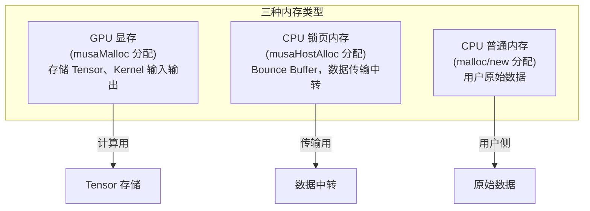

这三种内存有不同的特性：

| 内存类型 | 分配方式 | 能否异步拷贝 | 典型用途 |
|---------|---------|------------|---------|
| GPU 显存 | `musaMalloc` | - | Tensor 存储 |
| CPU 锁页内存 | `musaHostAlloc` | ✅ 可以 | 传输中转 |
| CPU 普通内存 | `malloc/new` | ❌ 不可以 | 用户数据 |

项目中使用两个不同的分配器来管理这些内存：

- **BFCAllocator**：管理 GPU 显存（Tensor 存储）
- **GPUPinnedMemoryPool**：管理 CPU 锁页内存（Bounce Buffer）

---

## 二、BFCAllocator：管理 GPU 显存

### 2.1 使用场景

BFCAllocator 负责 Tensor 的存储，即 OpKernel 的输入输出：

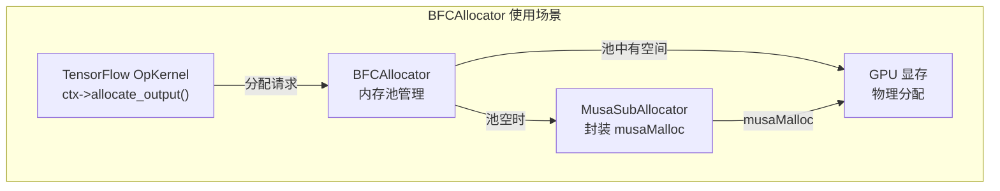

### 2.2 Tensor 的生命周期

Tensor 的分配和释放流程如下：

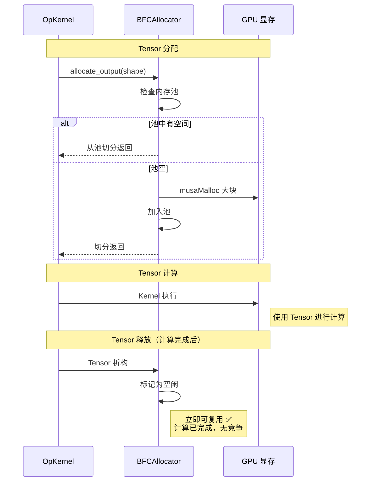

**关键点**：Tensor 释放时，计算已经完成。这是一个**同步释放**过程，内存可以立即复用，不会产生竞争问题。

### 2.3 代码示例

Tensor 分配调用链：

```cpp
// OpKernel 中分配输出 Tensor
ctx->allocate_output(0, shape, &output)
    ↓
device->GetAllocator(attr)  // 返回 BFCAllocator
    ↓
BFCAllocator::AllocateRaw(size)
    ↓
// 从内存池切分，或首次调用 musaMalloc 预分配
```

Tensor 释放调用链：

```cpp
// Tensor 析构（计算完成后）
Tensor::~Tensor()
    ↓
BFCAllocator::DeallocateRaw(ptr)
    ↓
// 标记为空闲，立即可复用 ← 安全！
```

---

## 三、为什么需要 Bounce Buffer？

### 3.1 Pageable 内存无法异步拷贝

`musaMemcpyAsync` 有一个重要限制：**源内存必须是 Pinned（锁页）内存**。

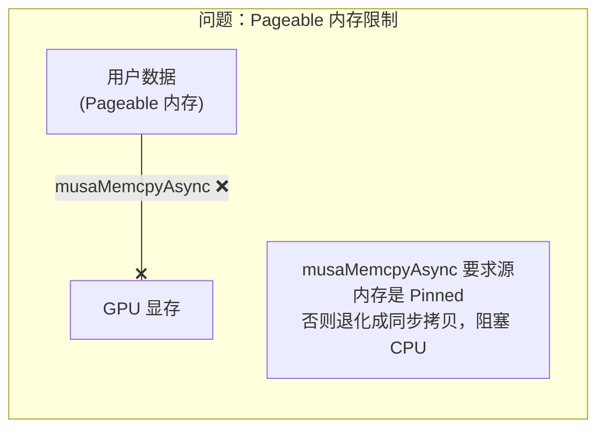

如果直接对 Pageable 内存调用 `musaMemcpyAsync`，MUSA 驱动会：
1. 退化成同步拷贝
2. CPU 被阻塞等待拷贝完成
3. 无法实现 H2D/D2H 与计算的并行

### 3.2 Bounce Buffer 方案

解决方案是使用 Pinned 内存作为中转站（即 Bounce Buffer）：

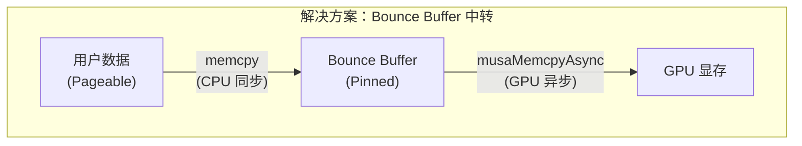

**工作流程**：
1. 先在 CPU 端将用户数据复制到 Bounce Buffer（同步 memcpy）
2. 然后异步将 Bounce Buffer 拷贝到 GPU（musaMemcpyAsync）
3. CPU 立即返回，可以继续执行其他任务
4. GPU 在后台完成拷贝

这样就实现了**数据传输与计算的并行**。

---

## 四、GPUPinnedMemoryPool：管理 Bounce Buffer

### 4.1 竞争问题的产生

问题在于：Bounce Buffer 的释放是**异步的**，但 BFCAllocator 会**立即复用**内存。

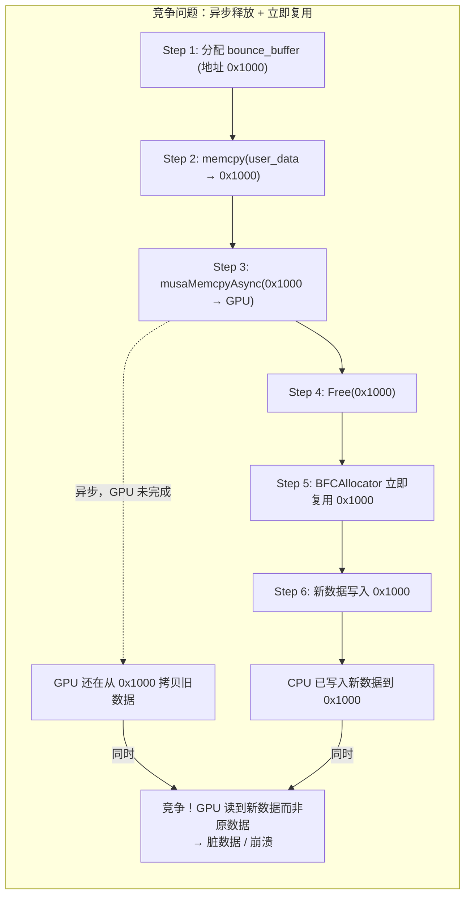

**时序分析**：

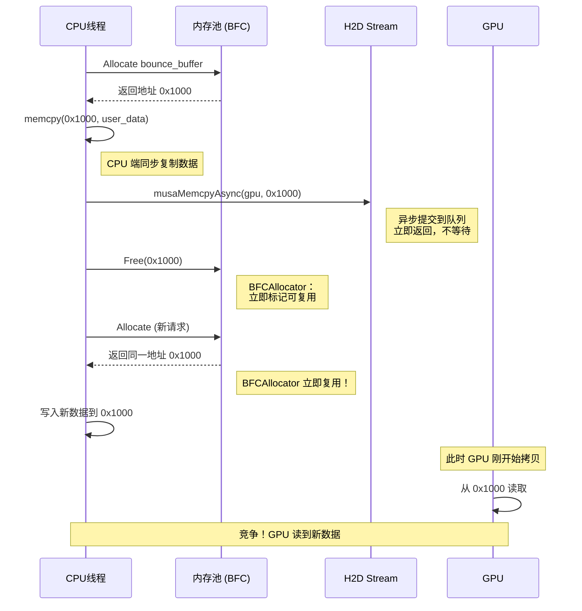

**关键矛盾**：
- `musaMemcpyAsync` 是异步的，CPU 返回后 GPU 可能还没开始拷贝
- BFCAllocator 在 `DeallocateRaw()` 后立即将内存标记为可复用
- 新分配可能使用同一地址并写入新数据
- GPU 异步拷贝仍在读旧地址 → **数据竞争**

### 4.2 GPUPinnedMemoryPool 的解决方案

GPUPinnedMemoryPool 使用 GPU Event 来追踪拷贝完成状态：

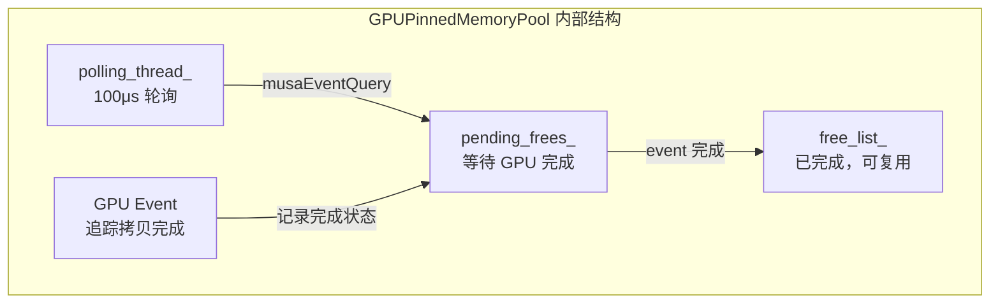

**工作流程**：

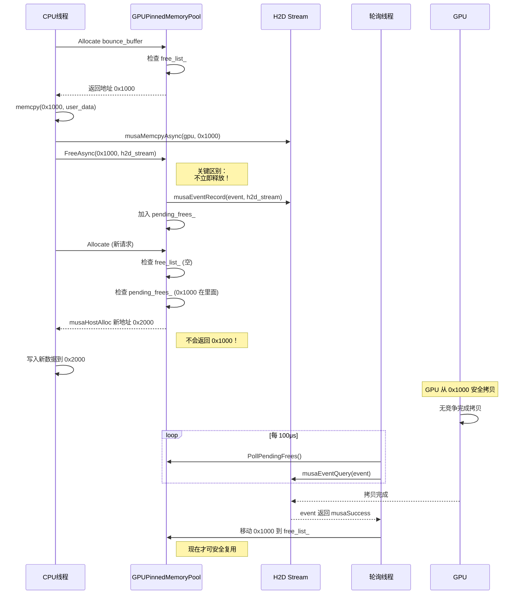

### 4.3 核心机制详解

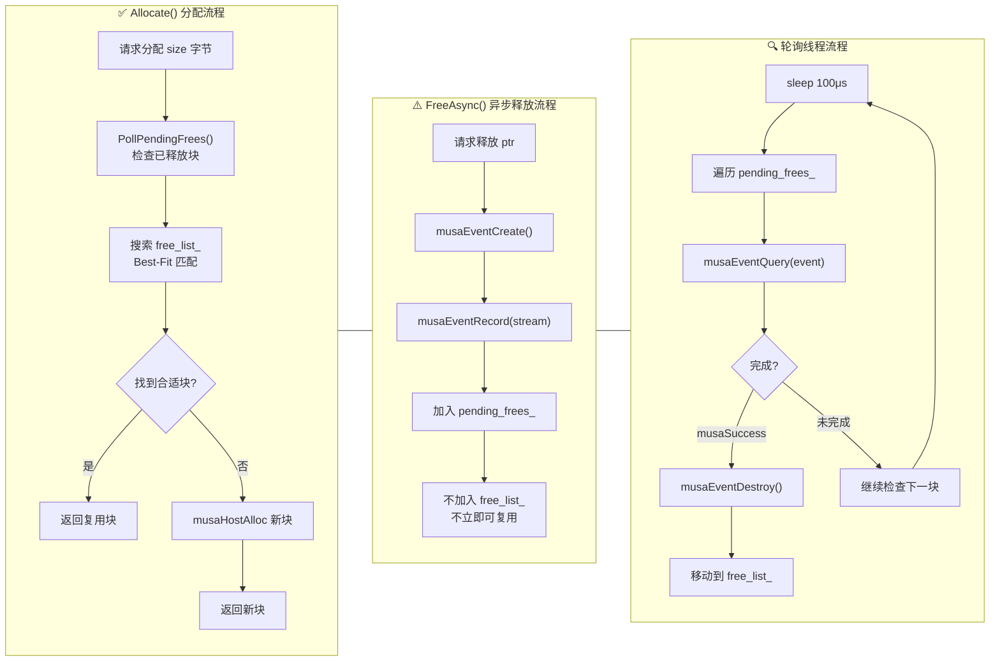

---

## 五、MusaEventMgr：异步回调管理器

### 5.1 为什么需要 MusaEventMgr？

在 D2H（Device to Host）场景中，数据从 GPU 拷贝到 Pageable 内存需要额外的步骤：

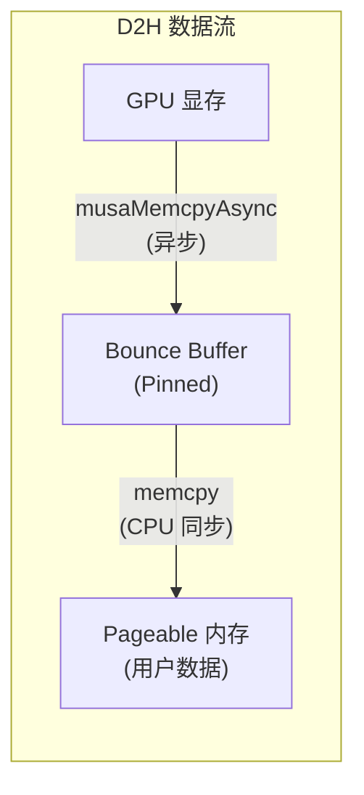

**问题**：
1. `musaMemcpyAsync(GPU → Bounce Buffer)` 是异步的，提交后立即返回
2. 需要**等待 GPU 拷贝完成**后，才能执行 `memcpy(Bounce → Pageable)`
3. 还需要调用 `FreeAsync` 释放 Bounce Buffer 并通知用户完成

**解决方案**：使用 MusaEventMgr 注册回调，在 GPU 操作完成后自动执行后续代码。

### 5.2 MusaEventMgr 与 GPUPinnedMemoryPool 的区别

两者都使用 **Event + 轮询** 技术，但目的不同：

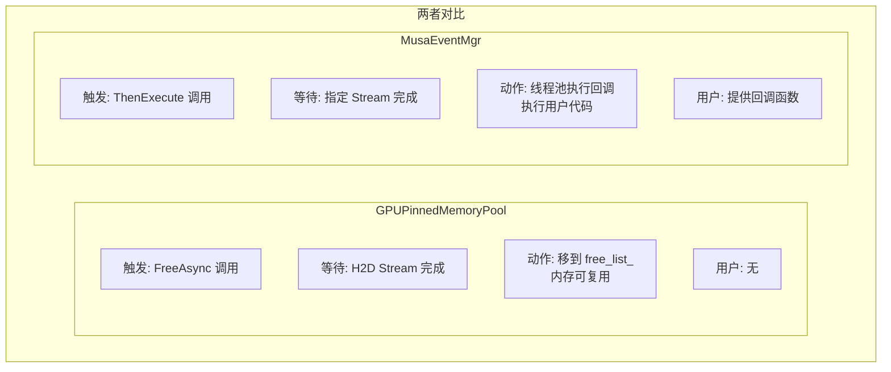

| 特性 | GPUPinnedMemoryPool | MusaEventMgr |
|------|---------------------|--------------|
| **触发时机** | `FreeAsync(ptr, stream)` | `ThenExecute(stream, func)` |
| **等待对象** | H2D Stream 的拷贝完成 | 任意 Stream 的操作完成 |
| **完成后动作** | 内存块移到 `free_list_` | 线程池执行回调函数 |
| **用户参与** | 无（内部管理） | 用户提供回调代码 |
| **主要场景** | H2D（内存释放） | D2H（回调执行） |
| **线程池** | 无 | 8线程线程池 |

### 5.3 MusaEventMgr 内部结构

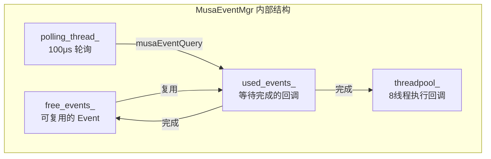

**核心组件**：

| 组件 | 类型 | 作用 |
|------|------|------|
| `free_events_` | `std::vector<musaEvent_t>` | Event 池，复用已销毁的 Event |
| `used_events_` | `std::list<InUse>` | 待完成的回调队列（list 支持 Out-of-Order） |
| `polling_thread_` | `std::thread` | 专用轮询线程，每 100μs 检查 |
| `threadpool_` | `ThreadPool (8线程)` | 执行回调，避免阻塞轮询线程 |

### 5.4 ThenExecute 流程详解

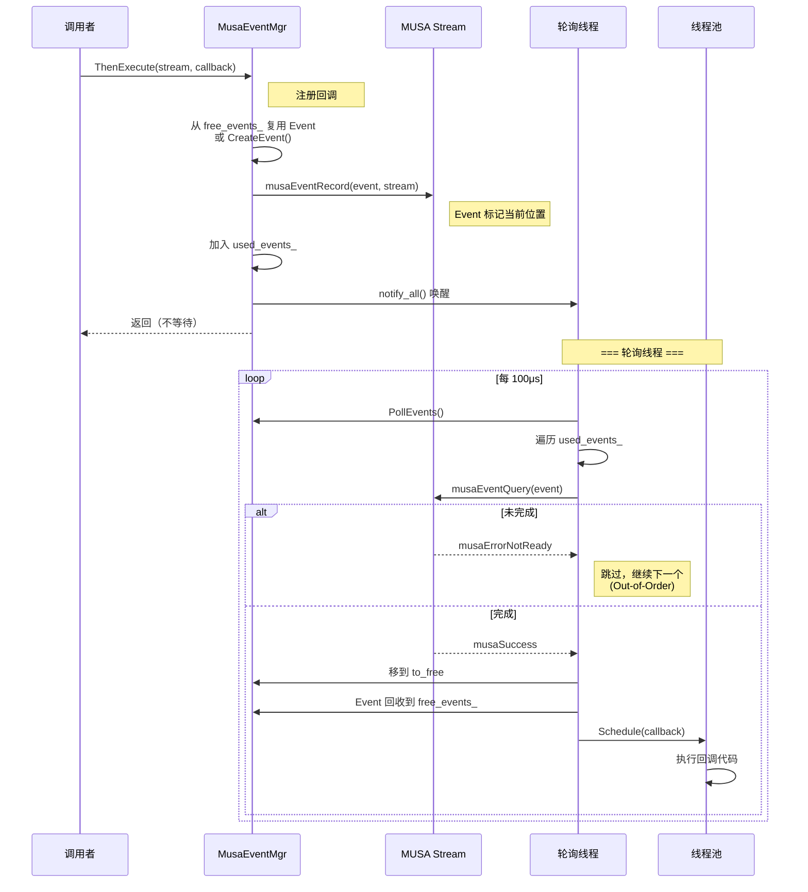

### 5.5 Out-of-Order 完成机制

**问题：Head-of-Line (HOL) 阻塞**

如果多个回调按顺序排队，前面的慢回调会阻塞后面快的：

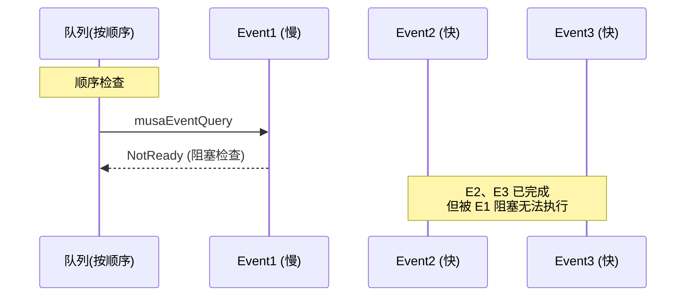

**解决方案：使用 std::list 支持乱序完成**

```cpp
// PollEvents 实现 - 乱序完成
auto it = used_events_.begin();
while (it != used_events_.end()) {
    musaError_t err = musaEventQuery(it->event);
    if (err == musaErrorNotReady) {
        ++it;  // 未完成，跳过，继续检查后面的
        continue;
    }
    // 完成了，立即处理，不影响其他
    to_free->push_back(std::move(*it));
    it = used_events_.erase(it);
}
```

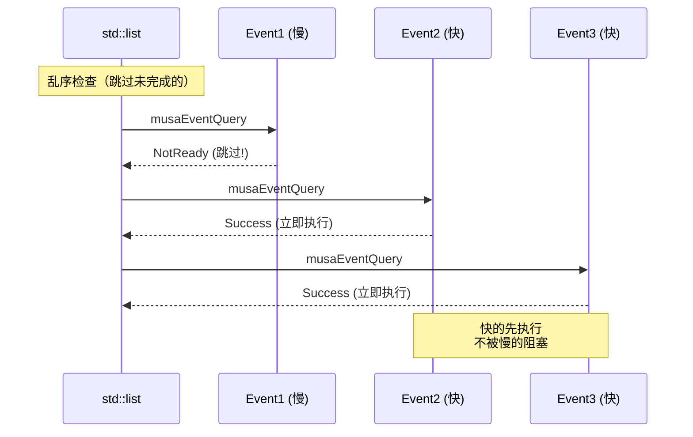

### 5.6 线程池执行回调

轮询线程只负责**检测完成**，回调在独立线程池执行：

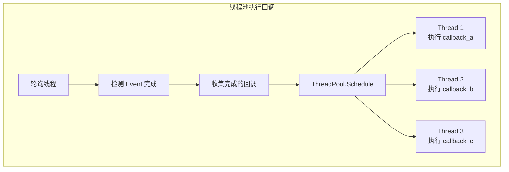

**分离原因**：
- 如果回调也由轮询线程执行，慢回调会阻塞后续 Event 检测
- 分离后，轮询线程始终运行，回调在独立线程并发执行

### 5.7 D2H 中的 MusaEventMgr 使用

D2H 流程中注册了两个回调：

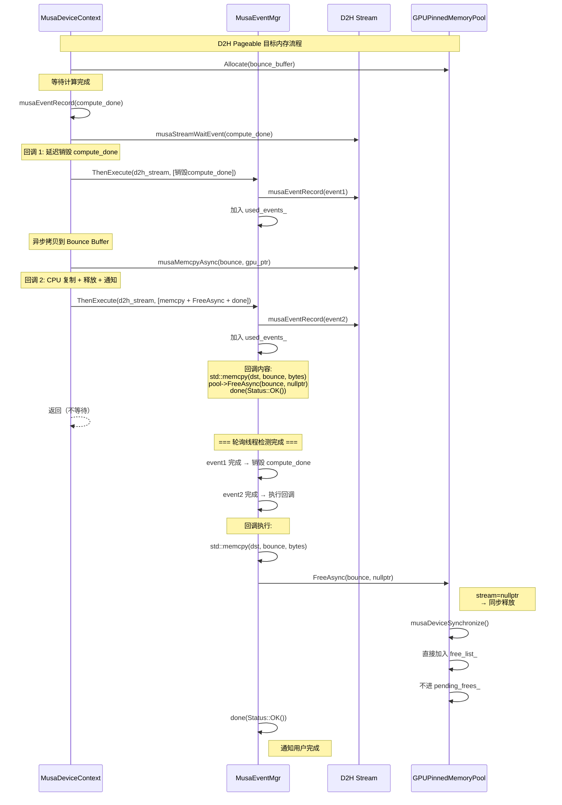

**代码位置**：`musa_device.cc:377-385`

```cpp
// D2H Pageable 目标内存：使用 MusaEventMgr
if (event_mgr_) {
    event_mgr_->ThenExecute(d2h_stream_, [musa_dev, device_id, dst,
                                          bounce_buffer, bytes, done]() {
        musaSetDevice(device_id);
        std::memcpy(dst, bounce_buffer, bytes);  // CPU 端复制
        musa_dev->pinned_memory_pool()->FreeAsync(bounce_buffer, bytes, nullptr);
        done(Status::OK());  // 通知用户完成
    });
}
```

### 5.8 H2D vs D2H：为什么 H2D 不需要 MusaEventMgr？

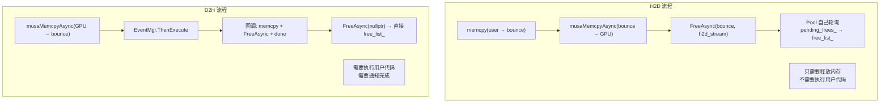

| 流程 | 完成后动作 | 使用组件 |
|------|-----------|---------|
| **H2D** | 只释放内存 | GPUPinnedMemoryPool 自己轮询 |
| **D2H** | memcpy + 释放 + 通知 | MusaEventMgr + 线程池 |

---

## 六、三者分工对比

### 6.1 职责对比

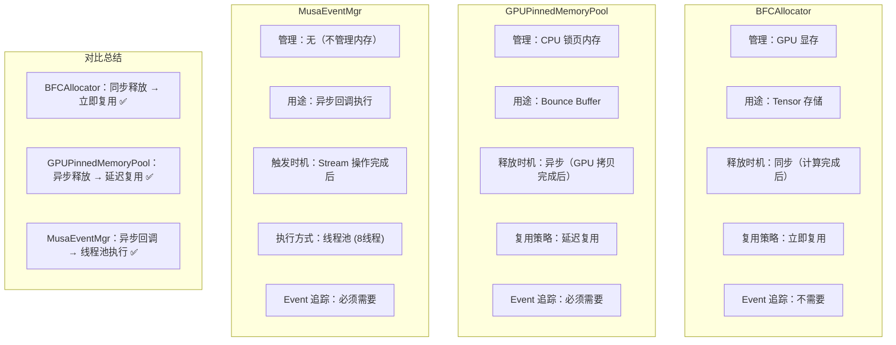

### 6.2 详细对比表

| 特性 | BFCAllocator | GPUPinnedMemoryPool | MusaEventMgr |
|------|--------------|---------------------|--------------|
| **管理对象** | GPU 显存 | CPU 锁页内存 | 无（回调管理） |
| **分配 API** | `musaMalloc` | `musaHostAlloc` | 无 |
| **用途** | Tensor 存储 | Bounce Buffer | D2H 回调执行 |
| **释放时状态** | 计算已完成 | GPU 可能还在拷贝 | Stream 操作完成 |
| **释放方式** | `DeallocateRaw()` 同步 | `FreeAsync()` 异步 | 回调自动执行 |
| **能否立即复用** | ✅ 安全 | ❌ 不安全 | N/A |
| **Event 追踪** | 不需要 | 必须需要 | 必须需要 |
| **轮询机制** | 无 | 有专用线程 (100μs) | 有专用线程 (100μs) |
| **线程池** | 无 | 无 | 8线程 |
| **内存池结构** | 单一内存池 | `free_list_` + `pending_frees_` | `free_events_` + `used_events_` |
| **Out-of-Order** | 无 | 部分 | 完全支持 |

### 6.3 为什么不能用 BFCAllocator 管理 Bounce Buffer？

```mermaid
flowchart TB
    subgraph TensorCase["Tensor 场景 (BFCAllocator 适用)"]
        T1["分配 Tensor"]
        T2["Kernel 计算"]
        T3["计算完成"]
        T4["释放 Tensor"]
        T5["立即可复用 ✅"]

        T1 --> T2 --> T3 --> T4 --> T5
        Note1["释放时计算已完成<br/>无后续 GPU 操作"]
    end

    subgraph BounceCase["Bounce Buffer 场景 (BFCAllocator 不适用)"]
        B1["分配 Bounce Buffer"]
        B2["musaMemcpyAsync"]
        B3["释放 Bounce Buffer"]
        B4["立即复用同一地址"]
        B5["GPU 还在拷贝 ❌"]

        B1 --> B2 --> B3 --> B4
        B2 -.->|"异步，未完成"| B5
        B4 -->|"写入新数据"| B5

        Note2["释放时 GPU 可能还在拷贝<br/>立即复用会导致竞争"]
    end
```

**核心区别**：

| 场景 | Tensor | Bounce Buffer |
|------|--------|---------------|
| **释放时 GPU 状态** | 计算已完成 | 拷贝可能还在进行 |
| **释放后是否还有 GPU 操作** | 没有 | 可能还有异步拷贝 |
| **能否立即复用** | ✅ 安全 | ❌ 需要等待 |

---

## 七、实际代码流程

### 7.1 CopyCPUTensorToDevice (H2D 传输)

```mermaid
flowchart TB
    subgraph H2DFlow["Host → Device 数据传输流程"]
        direction TB

        Check["检查源内存类型"]
        PinnedPath["Pinned 路径：<br/>直接 musaMemcpyAsync"]
        PageablePath["Pageable 路径：<br/>使用 Bounce Buffer"]

        Check -->|"Pinned"| PinnedPath
        Check -->|"Pageable"| PageablePath

        subgraph BounceBufferFlow["Bounce Buffer 详细流程"]
            BB1["pinned_memory_pool_->Allocate(bytes)"]
            BB2["memcpy(bounce, src, bytes)"]
            BB3["musaMemcpyAsync(dst, bounce, h2d_stream)"]
            BB4["pinned_memory_pool_->FreeAsync(bounce, h2d_stream)"]

            BB1 --> BB2 --> BB3 --> BB4
        end

        PageablePath --> BounceBufferFlow
    end
```

**代码位置**：`musa_device.cc:148-212`

```cpp
// Pageable 内存路径
void* bounce_buffer = musa_dev->pinned_memory_pool()->Allocate(bytes);

// Stage 1: CPU 端复制到 Bounce Buffer
std::memcpy(bounce_buffer, src, bytes);

// Stage 2: 异步拷贝到 GPU
musaMemcpyAsync(dst, bounce_buffer, bytes, musaMemcpyHostToDevice, h2d_stream_);

// Stage 3: 异步释放（关键！）
musa_dev->pinned_memory_pool()->FreeAsync(bounce_buffer, bytes, h2d_stream_);
// ↑ 不立即复用，等 GPU 完成后才加入 free_list_
```

### 7.2 内存池初始化

**代码位置**：`musa_device.cc:489-510`

```cpp
// GPU 显存分配器 (BFCAllocator)
musa_allocator_ = new BFCAllocator(
    new MusaSubAllocator(device_id_, {}, {}),
    bfc_memory_limit,      // 72GB
    false,                 // allow_growth=false (预分配)
    "Musa_BFC_Allocator",
    true                   // garbage_collection=true
);

// CPU 锁页内存池 (GPUPinnedMemoryPool)
pinned_memory_pool_ = new GPUPinnedMemoryPool(device_id_);
```

---

## 八、总结

```mermaid
flowchart TB
    subgraph FinalSummary["一句话总结"]
        BFC_Sum["BFCAllocator：<br/>管 Tensor (GPU 显存)<br/>释放时计算已完成<br/>→ 立即复用 ✅"]
        Pool_Sum["GPUPinnedMemoryPool：<br/>管 Bounce Buffer (CPU 锁页)<br/>释放时 GPU 可能还在拷贝<br/>→ 延迟复用 ✅"]
        EventMgr_Sum["MusaEventMgr：<br/>管异步回调<br/>D2H 完成后执行用户代码<br/>→ 线程池执行 ✅"]

        Note["三者各司其职：<br/>内存管理 vs 回调管理<br/>互不冲突，协作完成"]
    end
```

**核心要点**：

1. **BFCAllocator** 管理 GPU 显存，用于 Tensor 存储。Tensor 释放时计算已完成，可以立即复用。

2. **GPUPinnedMemoryPool** 管理 CPU 锁页内存，用于 Bounce Buffer。释放时 GPU 可能还在异步拷贝，必须通过 Event 追踪等待完成后才能复用。

3. **MusaEventMgr** 管理异步回调，用于 D2H 流程中等待 GPU 完成后执行 CPU 端复制、释放内存、通知用户等操作。

4. **三者互不冲突**，GPUPinnedMemoryPool 负责内存管理，MusaEventMgr 负责回调执行，各司其职。

5. **Bounce Buffer 的存在**是为了让 Pageable 内存也能实现异步拷贝，从而实现数据传输与计算的并行。

---

## 九、完整场景流程

以下是一个典型的 `session.run(matmul)` 执行过程中，内存分配、传输、计算、释放及回调的完整流程。

### 9.1 场景总览

```mermaid
flowchart TB
    subgraph Scenarios["所有内存分配场景"]
        S1["场景 1: Tensor 分配<br/>(GPU 显存, BFCAllocator)"]
        S2["场景 2: Host Pinned 内存分配<br/>(BFCAllocator + MusaHostSubAllocator)"]
        S3["场景 3: Bounce Buffer 分配<br/>(GPUPinnedMemoryPool)"]
        S4["场景 4: H2D - Pinned 源内存<br/>(直接异步拷贝)"]
        S5["场景 5: H2D - Pageable 源内存<br/>(使用 Bounce Buffer)"]
        S6["场景 6: D2H - Pinned 目标内存<br/>(直接异步拷贝)"]
        S7["场景 7: D2H - Pageable 目标内存<br/>(使用 Bounce Buffer)"]
        S8["场景 8: 小数据量传输<br/>(同步拷贝, 无 Bounce Buffer)"]
        S9["场景 9: 分配失败回退<br/>(同步拷贝)"]
    end
```

### 9.2 完整执行流程

以用户执行 `session.run(matmul_op)` 为例，展示完整的内存流动和回调执行：

```mermaid
sequenceDiagram
    participant User as 用户代码
    participant TF as TensorFlow
    participant BFC_GPU as BFCAllocator<br/>(GPU 显存)
    participant BFC_HOST as BFCAllocator<br/>(Host Pinned)
    participant PINNED_POOL as GPUPinnedMemoryPool<br/>(Bounce Buffer)
    participant EVENT_MGR as MusaEventMgr<br/>(回调管理)
    participant H2D as H2D Stream
    participant Compute as Compute Stream
    participant D2H as D2H Stream
    participant Pool_Poll as Pool轮询线程
    participant Event_Poll as EventMgr轮询线程
    participant ThreadPool as EventMgr线程池
    participant GPU as GPU 显存

    Note over User, GPU: === 阶段 1: 初始化 (session 创建时) ===

    TF->>BFC_GPU: 构造 BFCAllocator
    Note right of BFC_GPU: memory_limit = free_memory * 0.9<br/>约 72GB

    TF->>BFC_HOST: 构造 Host BFCAllocator
    Note right of BFC_HOST: limit = 256MB

    TF->>PINNED_POOL: 构造 GPUPinnedMemoryPool
    Note right of PINNED_POOL: 启动 Pool 轮询线程

    TF->>EVENT_MGR: 构造 MusaEventMgr
    Note right of EVENT_MGR: 启动 EventMgr 轮询线程<br/>+ 8线程线程池

    Note over User, GPU: === 阶段 2: Tensor 分配 ===

    TF->>BFC_GPU: allocate_output(input_tensor)
    BFC_GPU->>BFC_GPU: AllocateRaw(1MB)
    alt 首次分配 (池空)
        BFC_GPU->>GPU: musaMalloc(72GB) [预分配]
        Note right of GPU: 首次分配大块
        BFC_GPU->>BFC_GPU: 将 72GB 加入池
        BFC_GPU->>BFC_GPU: 切分 1MB
    else 后续分配 (池有空间)
        BFC_GPU->>BFC_GPU: 从池 Best-Fit 切分
    end
    BFC_GPU-->>TF: 返回 GPU 地址 (input_ptr)

    TF->>BFC_GPU: allocate_output(output_tensor)
    BFC_GPU->>BFC_GPU: 从池切分 2MB
    BFC_GPU-->>TF: 返回 GPU 地址 (output_ptr)

    Note over User, GPU: === 阶段 3: 数据上传 (H2D) ===

    User->>TF: 提供 input_data (Pageable 内存)

    TF->>TF: 检测内存类型
    Note right of TF: musaPointerGetAttributes<br/>返回 musaMemoryTypeUnregistered

    alt 场景 5: Pageable 源内存 (> 1KB)
        TF->>PINNED_POOL: Allocate(1MB)
        PINNED_POOL->>PINNED_POOL: 检查 free_list_
        alt free_list_ 有块
            PINNED_POOL-->>TF: 返回复用块 (bounce_buffer)
        else free_list_ 空
            PINNED_POOL->>PINNED_POOL: musaHostAlloc(1MB)
            PINNED_POOL-->>TF: 返回新块 (bounce_buffer)
        end

        TF->>TF: memcpy(bounce_buffer, input_data)
        Note right of TF: CPU 端同步复制

        TF->>H2D: musaMemcpyAsync(input_ptr, bounce_buffer)
        Note right of H2D: 异步提交，立即返回

        TF->>PINNED_POOL: FreeAsync(bounce_buffer, h2d_stream)
        PINNED_POOL->>H2D: musaEventRecord(event, h2d_stream)
        PINNED_POOL->>PINNED_POOL: 加入 pending_frees_
        Note right of PINNED_POOL: 不立即复用！

        TF->>Compute: musaStreamWaitEvent(h2d_event)
        Note right of Compute: Compute 等待 H2D 完成
    else 场景 8: 小数据量 (< 1KB)
        TF->>H2D: musaMemcpy(input_ptr, input_data)
        Note right of H2D: 同步拷贝，无 Bounce Buffer
    end

    Note over User, GPU: === 阶段 4: Kernel 计算 ===

    TF->>Compute: MatMulOp::Compute()
    Compute->>GPU: Kernel 执行 (input_ptr → output_ptr)
    Note right of GPU: GPU 计算结果

    Note over User, GPU: === 阶段 5: 数据下载 (D2H) ===

    TF->>TF: 检测目标内存类型
    Note right of TF: cpu_tensor 是 Pageable

    alt 场景 7: Pageable 目标内存 (> 1KB)
        TF->>PINNED_POOL: Allocate(2MB)
        PINNED_POOL-->>TF: 返回 (bounce_buffer_2)

        TF->>Compute: musaEventRecord(compute_done, compute_stream)
        TF->>D2H: musaStreamWaitEvent(compute_done)
        Note right of D2H: D2H 等待计算完成

        TF->>EVENT_MGR: ThenExecute(d2h_stream, [销毁compute_done])
        EVENT_MGR->>D2H: musaEventRecord(event1)
        EVENT_MGR->>EVENT_MGR: 加入 used_events_
        Note right of EVENT_MGR: 回调1: 延迟销毁同步Event

        TF->>D2H: musaMemcpyAsync(bounce_buffer_2, output_ptr)
        Note right of D2H: GPU → Bounce Buffer (异步)

        TF->>EVENT_MGR: ThenExecute(d2h_stream, [memcpy+FreeAsync+done])
        EVENT_MGR->>D2H: musaEventRecord(event2)
        EVENT_MGR->>EVENT_MGR: 加入 used_events_
        Note right of EVENT_MGR: 回调2: CPU复制+释放+通知

        TF-->>User: 返回（不等待完成）
    end

    Note over Pool_Poll, Event_Poll: === 阶段 6: 轮询线程并行运行 ===

    loop Pool轮询线程 每100μs
        Pool_Poll->>PINNED_POOL: PollPendingFrees()
        Pool_Poll->>Pool_Poll: 遍历 pending_frees_
        Pool_Poll->>H2D: musaEventQuery(event)
        alt event 完成
            Pool_Poll->>PINNED_POOL: musaEventDestroy(event)
            Pool_Poll->>PINNED_POOL: 移动到 free_list_
            Note right of PINNED_POOL: H2D bounce 可复用
        else event 未完成
            Pool_Poll->>Pool_Poll: 跳过，继续下一个
        end
    end

    loop EventMgr轮询线程 每100μs
        Event_Poll->>EVENT_MGR: PollEvents()
        Event_Poll->>Event_Poll: 遍历 used_events_ (Out-of-Order)
        Event_Poll->>D2H: musaEventQuery(event1)
        alt event1 未完成
            Event_Poll->>Event_Poll: 跳过
        else event1 完成
            Event_Poll->>EVENT_MGR: event 回收到 free_events_
            Event_Poll->>ThreadPool: Schedule([销毁compute_done])
            ThreadPool->>ThreadPool: musaEventDestroy(compute_done)
        end
        Event_Poll->>D2H: musaEventQuery(event2)
        alt event2 未完成
            Event_Poll->>Event_Poll: 跳过
        else event2 完成
            Event_Poll->>EVENT_MGR: event 回收到 free_events_
            Event_Poll->>ThreadPool: Schedule([memcpy+FreeAsync+done])
            ThreadPool->>ThreadPool: std::memcpy(dst, bounce_buffer_2, bytes)
            ThreadPool->>PINNED_POOL: FreeAsync(bounce_buffer_2, nullptr)
            Note right of PINNED_POOL: stream=nullptr<br/>→ 同步释放
            PINNED_POOL->>PINNED_POOL: musaDeviceSynchronize()
            PINNED_POOL->>PINNED_POOL: 直接加入 free_list_
            ThreadPool->>User: done(Status::OK())
            Note right of User: 用户收到完成通知
        end
    end

    Note over User, GPU: === 阶段 7: Tensor 释放 ===

    TF->>BFC_GPU: input_tensor 析构
    BFC_GPU->>BFC_GPU: DeallocateRaw(input_ptr)
    Note right of BFC_GPU: 标记空闲，立即可复用 ✅

    TF->>BFC_GPU: output_tensor 析构
    BFC_GPU->>BFC_GPU: DeallocateRaw(output_ptr)
    Note right of BFC_GPU: 标记空闲，立即可复用 ✅
```

### 9.3 各场景详细说明

#### 场景 1: Tensor 分配 (GPU 显存)

```mermaid
flowchart TB
    subgraph TensorAlloc["Tensor 分配流程"]
        T1["ctx->allocate_output()"]
        T2["device->GetAllocator()"]
        T3["BFCAllocator::AllocateRaw()"]
        T4{"内存池状态?"}
        T5["首次分配: musaMalloc(72GB)<br/>加入池后切分"]
        T6["后续分配: 从池 Best-Fit 切分"]
        T7["返回 GPU 地址"]

        T1 --> T2 --> T3 --> T4
        T4 -->|"池空"| T5 --> T7
        T4 -->|"池有空间"| T6 --> T7
    end
```

**分配器**: BFCAllocator + MusaSubAllocator
**内存类型**: GPU 显存 (musaMalloc)
**生命周期**: 计算完成后释放，立即复用

#### 场景 2: Host Pinned 内存分配

```mermaid
flowchart TB
    subgraph HostPinnedAlloc["Host Pinned 内存分配"]
        H1["需要 CPU 锁页内存<br/>(如 Dataset 预取)"]
        H2["device->musa_host_allocator()"]
        H3["BFCAllocator::AllocateRaw()"]
        H4{"内存池状态?"}
        H5["MusaHostSubAllocator::Alloc()<br/>→ musaHostAlloc()"]
        H6["从池切分"]
        H7["返回 Pinned 地址"]

        H1 --> H2 --> H3 --> H4
        H4 -->|"池空"| H5 --> H7
        H4 -->|"池有空间"| H6 --> H7
    end
```

**分配器**: BFCAllocator + MusaHostSubAllocator
**内存类型**: CPU 锁页内存 (musaHostAlloc)
**用途**: Dataset 预取、持久化缓冲区等
**特点**: 可直接用于 musaMemcpyAsync

#### 场景 3: Bounce Buffer 分配

```mermaid
flowchart TB
    subgraph BounceAlloc["Bounce Buffer 分配"]
        B1["CopyCPUTensorToDevice<br/>(Pageable 源)"]
        B2["pinned_memory_pool_->Allocate()"]
        B3["PollPendingFrees()<br/>检查完成的块"]
        B4{"free_list_ 有合适块?"}
        B5["Best-Fit 匹配<br/>返回复用块"]
        B6["musaHostAlloc()<br/>返回新块"]
        B7["返回 Bounce Buffer 地址"]

        B1 --> B2 --> B3 --> B4
        B4 -->|"有"| B5 --> B7
        B4 -->|"无"| B6 --> B7
    end
```

**分配器**: GPUPinnedMemoryPool
**内存类型**: CPU 锁页内存 (musaHostAlloc)
**用途**: Pageable 内存传输中转
**特点**: 异步释放，延迟复用

#### 场景 4: H2D - Pinned 源内存

```mermaid
flowchart LR
    subgraph H2DPinned["H2D Pinned 快速路径"]
        direction LR
        P1["源内存是 Pinned"]
        P2["直接 musaMemcpyAsync()<br/>(GPU, pinned_src)"]
        P3["无需 Bounce Buffer"]
        P4["Event 同步 Compute Stream"]

        P1 --> P2 --> P3 --> P4
    end
```

**代码位置**: `musa_device.cc:70-132`

```cpp
// Pinned 内存路径：直接异步拷贝
if (is_pinned) {
    musaMemcpyAsync(dst, src, bytes, musaMemcpyHostToDevice, h2d_stream_);
    // Event 同步 compute stream
    musaEventRecord(event, h2d_stream_);
    musaStreamWaitEvent(stream_handle_, event);
}
```

**优点**: 无需 Bounce Buffer，效率最高

#### 场景 5: H2D - Pageable 源内存

```mermaid
flowchart LR
    subgraph H2DPageable["H2D - Pageable 源内存 "]
        direction LR

        PG1["源内存是 Pageable"]
        PG2["Allocate Bounce Buffer"]
        PG3["memcpy(bounce, pageable_src)<br/>(CPU 同步)"]
        PG4["musaMemcpyAsync(gpu, bounce)<br/>(GPU 异步)"]
        PG5["FreeAsync(bounce, h2d_stream)"]
        PG6["加入 pending_frees_<br/>不立即复用"]
        PG7["Event 同步 Compute Stream"]

        PG1 --> PG2 --> PG3 --> PG4 --> PG5 --> PG6 --> PG7
    end
```

**代码位置**: `musa_device.cc:148-212`

```cpp
// Pageable 内存路径：使用 Bounce Buffer
void* bounce_buffer = pinned_memory_pool_->Allocate(bytes);

// Stage 1: CPU 端复制
std::memcpy(bounce_buffer, src, bytes);

// Stage 2: 异步拷贝到 GPU
musaMemcpyAsync(dst, bounce_buffer, bytes, musaMemcpyHostToDevice, h2d_stream_);

// Stage 3: 异步释放（关键！）
pinned_memory_pool_->FreeAsync(bounce_buffer, bytes, h2d_stream_);
```

#### 场景 6: D2H - Pinned 目标内存

```mermaid
flowchart LR
    subgraph D2HPinned["D2H - Pinned 目标内存 (快速路径)"]
        direction LR

        DP1["目标内存是 Pinned"]
        DP2["Event 记录 Compute 完成"]
        DP3["D2H Stream 等待 Event"]
        DP4["musaMemcpyAsync(pinned_dst, gpu)"]
        DP5["无需 Bounce Buffer"]

        DP1 --> DP2 --> DP3 --> DP4 --> DP5
    end
```

**代码位置**: `musa_device.cc:258-303`

```cpp
// Pinned 目标内存：直接异步拷贝
if (is_pinned) {
    musaEventRecord(compute_done_event, stream_handle_);
    musaStreamWaitEvent(d2h_stream_, compute_done_event);
    musaMemcpyAsync(dst, src, bytes, musaMemcpyDeviceToHost, d2h_stream_);
}
```

#### 场景 7: D2H - Pageable 目标内存

```mermaid
flowchart TB
    subgraph D2HPageable["D2H - Pageable 目标内存 (完整流程)"]
        direction TB

        DH1["目标内存是 Pageable"]
        DH2["Pool.Allocate Bounce Buffer"]
        DH3["musaEventRecord(compute_done)"]
        DH4["D2H Stream 等待 compute_done"]

        subgraph AsyncCopy["异步拷贝阶段"]
            DH5["musaMemcpyAsync(GPU → bounce)"]
            DH6["EventMgr.ThenExecute(回调1)<br/>[销毁 compute_done]"]
            DH7["EventMgr.ThenExecute(回调2)<br/>[memcpy + FreeAsync + done]"]
        end

        subgraph PollPhase["轮询阶段"]
            DH8["EventMgr 轮询线程<br/>musaEventQuery"]
            DH9["完成 → EventMgr 线程池执行"]
        end

        subgraph CallbackExec["回调执行"]
            DH10["回调1: musaEventDestroy(compute_done)"]
            DH11["回调2: memcpy(dst, bounce)"]
            DH12["回调2: Pool.FreeAsync(bounce, nullptr)"]
            DH13["Pool: musaDeviceSynchronize()"]
            DH14["Pool: 直接加入 free_list_"]
            DH15["回调2: done(Status::OK())"]
        end

        DH1 --> DH2 --> DH3 --> DH4 --> DH5 --> DH6 --> DH7 --> DH8 --> DH9
        DH9 --> DH10
        DH9 --> DH11 --> DH12 --> DH13 --> DH14 --> DH15
    end
```

**关键点**：
- D2H 使用 **MusaEventMgr** 管理回调，因为需要执行用户代码（memcpy + done通知）
- `FreeAsync(bounce, nullptr)` 中 `stream=nullptr` → **同步释放**，不进 `pending_frees_`
- Pool 轮询线程不参与 D2H bounce buffer 的释放（因为已同步释放）

**代码位置**: `musa_device.cc:304-392`

```cpp
// Pageable 目标内存：使用 Bounce Buffer + MusaEventMgr
void* bounce_buffer = pinned_memory_pool_->Allocate(bytes);

// 等待计算完成
musaEventRecord(compute_done_event, stream_handle_);
musaStreamWaitEvent(d2h_stream_, compute_done_event);

// 回调1: 延迟销毁 compute_done_event（避免竞争）
event_mgr_->ThenExecute(d2h_stream_, [compute_done_event, device_id]() {
    musaEventDestroy(compute_done_event);
});

// Stage 1: 异步拷贝到 Bounce Buffer
musaMemcpyAsync(bounce_buffer, src, bytes, musaMemcpyDeviceToHost, d2h_stream_);

// Stage 2: 回调中复制到 Pageable 目标
event_mgr_->ThenExecute(d2h_stream_, [bounce_buffer, dst, bytes, done]() {
    std::memcpy(dst, bounce_buffer, bytes);           // CPU 端复制
    pinned_memory_pool_->FreeAsync(bounce_buffer, bytes, nullptr);  // 同步释放
    done(Status::OK());                               // 通知用户完成
});
```

#### 场景 8: 小数据量传输

```mermaid
flowchart TB
    subgraph SmallCopy["小数据量传输 (< 1KB)"]
        SC1["数据量 < 1KB"]
        SC2["使用同步拷贝 musaMemcpy()"]
        SC3["无需 Bounce Buffer"]
        SC4["避免小异步传输开销"]

        SC1 --> SC2 --> SC3 --> SC4
    end
```

**原因**: 小数据异步传输的 Event/Stream 开销可能超过实际传输时间，且可能导致驱动不稳定。

**代码位置**: `musa_device.cc:137-146` (H2D) 和 `musa_device.cc:306-315` (D2H)

#### 场景 9: 分配失败回退

```mermaid
flowchart TB
    subgraph Fallback["分配失败回退"]
        FB1["Bounce Buffer 分配失败"]
        FB2["回退到同步拷贝"]
        FB3["musaMemcpy() / musaDeviceSynchronize()"]
        FB4["确保数据正确传输"]

        FB1 --> FB2 --> FB3 --> FB4
    end
```

**代码位置**: `musa_device.cc:152-161` (H2D) 和 `musa_device.cc:319-329` (D2H)

### 9.4 内存流动全景图

```mermaid
flowchart TB
    subgraph MemoryFlow["完整内存流动 (含D2H)"]
        direction TB

        subgraph CPU_Side["CPU 端"]
            PageableIn["Pageable 输入<br/>用户数据"]
            PinnedBounce["Pinned Bounce Buffer<br/>中转用"]
            PageableOut["Pageable 输出<br/>返回给用户"]
        end

        subgraph GPU_Side["GPU 端"]
            GPU_Mem["GPU 显存<br/>Tensor 存储"]
        end

        subgraph Streams["3个流（CPU 控制）"]
            H2D["H2D Stream<br/>拷贝到GPU"]
            Compute["Compute Stream<br/>GPU计算"]
            D2H["D2H Stream<br/>从GPU拷回"]
        end

        %% 正向流程
        PageableIn -->|"CPU拷贝"| PinnedBounce
        PinnedBounce -->|"异步DMA"| H2D
        H2D -->|"数据入GPU"| GPU_Mem
        GPU_Mem -->|"计算"| Compute
        Compute -->|"生成结果"| GPU_Mem
        
        %% D2H 回拷
        GPU_Mem -->|"异步DMA"| D2H
        D2H -->|"拷回Pinned"| PinnedBounce
        PinnedBounce -->|"CPU拷贝"| PageableOut

    end
```

### 9.5 四种组件协作总结

```mermaid
flowchart TB
    subgraph AllocatorSummary["四种组件协作关系"]
        direction TB

        subgraph GPU_Mem_Manager["GPU 显存管理"]
            GPU_BFC["BFCAllocator"]
            GPU_Sub["MusaSubAllocator<br/>封装 musaMalloc"]
            GPU_Role["职责: Tensor 存储<br/>释放: 同步，立即复用"]

            GPU_BFC --> GPU_Sub --> GPU_Role
        end

        subgraph Host_Pinned_Manager["Host Pinned 管理"]
            Host_BFC["BFCAllocator"]
            Host_Sub["MusaHostSubAllocator<br/>封装 musaHostAlloc"]
            Host_Role["职责: 持久 Pinned 缓冲区<br/>释放: 同步，立即复用"]

            Host_BFC --> Host_Sub --> Host_Role
        end

        subgraph Bounce_Manager["Bounce Buffer 管理"]
            Bounce_Pool["GPUPinnedMemoryPool"]
            Bounce_Role["职责: 传输中转<br/>释放: 异步，延迟复用<br/>Event 追踪 + 轮询线程"]

            Bounce_Pool --> Bounce_Role
        end

        subgraph Callback_Manager["异步回调管理"]
            Event_Mgr["MusaEventMgr"]
            Event_Role["职责: D2H 回调执行<br/>触发: Stream 完成<br/>Event 追踪 + 轮询线程 + 线程池"]

            Event_Mgr --> Event_Role
        end

        subgraph KeyDifference["关键区别"]
            Diff["同步释放 vs 异步释放<br/>立即复用 vs 延迟复用<br/>内存管理 vs 回调管理"]
        end

        GPU_Mem_Manager --> KeyDifference
        Host_Pinned_Manager --> KeyDifference
        Bounce_Manager --> KeyDifference
        Callback_Manager --> KeyDifference
    end
```


**文档版本**: 2026-04-15
**适用版本**: TensorFlow MUSA Extension v1.0+